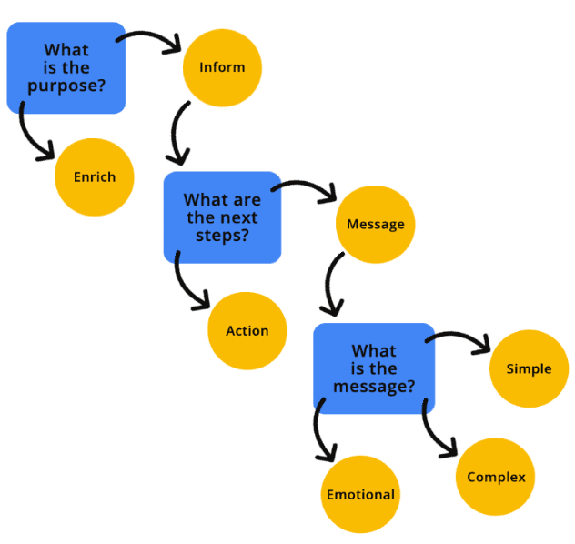

# 이미지

접근 가능한 이미지는 언뜻 보기에 간단한 주제처럼 보일 수 있습니다—이미지에 "대체 텍스트"만 추가하면 끝나는 것처럼 보입니다. 하지만 이 주제는 많은 사람들이 생각하는 것보다 더 세심한 주의가 필요합니다. 이 섹션에서는 다음 내용을 살펴보겠습니다:

- 이미지를 접근 가능하게 만들기 위한 코드 수정 방법
- 사용자와 공유해야 할 정보와 그 제공 위치
- 장애가 있는 사용자를 지원하기 위한 이미지 개선 방법

<br>

## 이미지의 목적과 맥락

코드를 작성하기 전에, 이미지의 목적과 위치, 사용 방법에 대해 먼저 생각해보세요. 이러한 질문들은 스크린 리더와 같은 [보조 기술(AT)](https://www.nichd.nih.gov/health/topics/rehabtech/conditioninfo/device)을 사용하는 사람들에게 정보를 가장 잘 전달할 수 있는 방법을 결정하는 데 도움이 됩니다.
다음과 같은 질문들을 해보세요:

- 이미지가 기능이나 페이지의 맥락을 이해하는 데 필수적인가요?
- 이미지가 전달하고자 하는 정보는 어떤 종류인가요?
- 이미지가 단순한가요, 아니면 복잡한가요?
- 이미지가 감정을 유발하거나 사용자의 행동을 유도하나요?
- 아니면 실제 목적 없이 시각적인 "채움"용으로만 사용되는 이미지인가요?

[이미지 결정 트리](https://www.w3.org/WAI/tutorials/images/decision-tree/)와 같은 시각적 순서도는 여러분의 이미지가 어떤 카테고리에 속하는지 결정하는 데 도움이 될 수 있습니다.
브라우저 확장 프로그램이나 다른 방법을 사용해 사이트나 웹 앱의 이미지를 숨겨보세요. 그리고 자문해보세요: "남아있는 콘텐츠를 이해할 수 있나요?" 답이 '예'라면 아마도 장식용 이미지일 것입니다. 만약 '아니오'라면, 그 이미지는 정보를 전달하는 역할을 하며 맥락상 필요한 것입니다. 이미지의 목적을 파악하고 나면, 그에 맞는 가장 정확한 코딩 방법을 결정할 수 있습니다.



<br>

### 장식용 이미지

[장식용 이미지](https://www.w3.org/WAI/tutorials/images/decorative/)는 사용자의 맥락 이해에 추가적인 정보를 제공하지 않는 시각적 요소입니다. 장식용 이미지는 보조적인 성격을 가지며, 내용보다는 스타일적인 요소를 제공합니다.
이미지가 장식용이라고 판단되면, 보조 기술(AT)에서 프로그래밍적으로 숨겨야 합니다. 이미지를 숨기도록 프로그래밍하면, 해당 이미지가 페이지의 내용, 맥락, 또는 동작을 이해하는 데 필요하지 않다는 것을 보조 기술에 알려주는 것입니다. 빈 값이나 null 값의 대체 텍스트 사용, [ARIA 속성 적용](https://developer.mozilla.org/docs/Web/Accessibility/ARIA), CSS 배경으로 이미지 추가 등 이미지를 숨기는 방법에는 여러 가지가 있습니다.

다음은 장식용 이미지를 사용자에게 숨기는 몇 가지 예시입니다.

> **Caution**: [장식용](https://www.smashingmagazine.com/2021/06/img-alt-attribute-alternate-description-decorative/)이라는 단어는 사용자마다 다르게 해석될 수 있습니다. 일부 보조 기술 사용자들은 화면의 모든 시각적 요소에 대한 설명을 듣기 원합니다. 사용자는 이미지 설명이 불필요하거나 너무 길다고 느낄 때 이를 건너뛸 수는 있지만, 아예 존재하지 않는 설명은 상상할 수 없습니다. 따라서 확신이 서지 않는다면, 이미지에 설명을 추가하는 것이 좋습니다.

**빈 값 또는 null 대체 텍스트**

[CODEPEN으로 예시 보기](https://codepen.io/web-dot-dev/pen/QWrMgxg)

빈 값 또는 null 대체 텍스트 속성은 대체 텍스트 속성이 누락된 것과는 다릅니다. 대체 텍스트 속성이 누락된 경우, 보조 기술은 사용자에게 이미지 관련 정보를 제공하기 위해 파일명이나 주변 콘텐츠를 읽을 수 있습니다.

**role을 presentation 또는 none으로 설정**

role을 [`presentation` 또는 `none`](https://developer.mozilla.org/docs/Web/Accessibility/ARIA/Roles/presentation_role)으로 설정하면 해당 요소의 의미론적 정보가 접근성 트리에 노출되지 않게 됩니다. 반면 [`aria-hidden="true"`](https://developer.mozilla.org/docs/Web/Accessibility/ARIA/Attributes/aria-hidden)는 해당 요소와 그 하위 요소 모두를 접근성 API에서 완전히 제거합니다.

[CODEPEN으로 예시 보기](https://codepen.io/web-dot-dev/pen/mdLMwje)

```html
<!-- All of these choices lead to the same result. -->


```

`aria-hidden`은 의도하지 않은 요소까지 숨길 수 있으므로 신중하게 사용해야 합니다.

**CSS의 이미지**

[CODEPEN으로 예시 보기](https://codepen.io/web-dot-dev/pen/GRdvEYo)

CSS로 배경 이미지를 추가하면 스크린 리더가 해당 이미지 파일을 감지할 수 없습니다. 따라서 이 방법을 적용하기 전에 해당 이미지를 정말 숨길 필요가 있는지 신중히 확인하세요.

<br>

### 정보 제공 이미지

[정보 제공 이미지](https://www.w3.org/WAI/tutorials/images/informative/)는 개념, 아이디어, 또는 감정을 전달하는 이미지입니다. 여기에는 실제 사물의 사진, 필수적인 아이콘, 간단한 그림, [텍스트를 포함한 이미지](https://www.w3.org/WAI/WCAG22/Understanding/images-of-text.html) 등이 포함됩니다.

이미지가 정보를 제공하는 경우, 이미지의 목적을 설명하는 [프로그래밍적 대체 텍스트](https://www.w3.org/WAI/WCAG21/Understanding/non-text-content.html)를 포함해야 합니다. 대체 이미지 설명(줄여서 "대체 텍스트" 또는 "alt 텍스트")은 보조 기술 사용자에게 이미지에 대한 더 많은 맥락을 제공하고, 이미지가 전달하고자 하는 메시지나 의도를 더 잘 이해할 수 있게 도와줍니다.

[`` 요소](https://developer.mozilla.org/docs/Web/HTML/Element/img#attr-alt)의 대체 설명은 `.jpg`, `.png`, `.svg` 등 파일 형식에 관계없이 `alt` 속성을 통해 추가됩니다.

```html

```

[CODEPEN으로 예시 보기](https://codepen.io/web-dot-dev/pen/yLjoXrj)

`<svg>` 요소를 인라인으로 사용할 때는 접근성에 특별한 주의가 필요합니다.

첫째, SVG는 의미론적으로 코딩되므로 보조 기술은 기본적으로 이를 건너뜁니다. 장식용 이미지의 경우에는 문제가 되지 않습니다—의도한 대로 보조 기술이 이를 무시하기 때문입니다. 하지만 정보 제공 이미지의 경우, 보조 기술이 이를 이미지로 인식할 수 있도록 ARIA `role="img"`를 추가해야 합니다.

둘째, `<svg>` 요소는 `alt` 속성을 사용하지 않기 때문에, 정보 제공 이미지에 대체 설명을 추가하려면 [다른 코딩 방법](https://codepen.io/web-dot-dev/pen/dyezRBP)을 사용해야 합니다.

```html
<svg role="img" ...>
  <title>Cartoon drawing of a red, black, and gray ladybug.</title>
</svg>
```

<br>

### 기능성 이미지

[기능성 이미지](https://www.w3.org/WAI/tutorials/images/functional/)는 특정 동작과 연결된 이미지입니다. 예를 들면 다음과 같습니다:

- 홈페이지로 연결되는 로고
- 검색 버튼으로 사용되는 돋보기 아이콘
- 다른 웹사이트나 앱으로 이동하는 소셜 미디어 아이콘

[CODEPEN으로 예시 보기](https://codepen.io/web-dot-dev/pen/YzLxxPw)

[CODEPEN으로 예시 보기](https://codepen.io/web-dot-dev/pen/gOzxxbg)

로고 예시에서 이미지는 정보를 전달하면서 동시에 링크로도 작동하므로, 정보 제공과 기능성을 모두 가지고 있습니다. 이런 경우 각 요소에 대체 설명을 모두 추가할 수 있지만, 이는 필수 사항은 아닙니다.

이미지에 대체 설명을 추가하는 한 가지 방법은 시각적으로 숨겨진 텍스트를 사용하는 것입니다. 이 방법을 사용하면 텍스트가 DOM에 존재하므로 스크린 리더가 읽을 수 있지만, 커스텀 CSS를 통해 시각적으로는 보이지 않게 됩니다.

코드 예시를 보면, "홈페이지로 이동"이 래퍼 제목이고 이미지의 대체 텍스트는 "잔디밭을 위한 사랑스러운 무당벌레"입니다. 스크린 리더로 이 로고 코드를 들으면, 하나의 이미지에서 시각적 설명과 동작 설명을 모두 들을 수 있습니다.

```html
<div title="Navigate to the homepage">
  <a href="/">
    
  </a>
</div>
```

[CODEPEN으로 예시 보기](https://codepen.io/web-dot-dev/pen/qBYXXdW)

<br>

### 복잡한 이미지

복잡한 이미지는 장식용, 정보 제공용, 기능성 이미지보다 더 자세한 설명이 필요합니다. 전체 메시지를 효과적으로 전달하기 위해서는 짧은 설명과 긴 설명이 모두 필요합니다. 복잡한 이미지는 인포그래픽, 지도, 그래프/차트, 복잡한 일러스트레이션를 포함합니다.

다른 유형의 이미지와 마찬가지로, 복잡한 이미지에도 대체 설명을 추가할 수 있는 다양한 방법이 있습니다.

[CODEPEN으로 예시 보기](https://codepen.io/web-dot-dev/pen/NWMvvqw)

```html

<a href="ladybug-science.html">Learn more about the anatomy of a ladybug</a>
```

이미지에 추가 설명을 넣는 한 가지 방법은 관련 리소스로 연결되는 링크나 페이지 내의 상세 설명으로 이동하는 건너뛰기 링크를 제공하는 것입니다. 이 방법은 보조 기술 사용자뿐만 아니라 인지 장애, 학습 장애, 읽기 장애와 같은 장애가 있는 사용자에게도 좋은 선택입니다—추가 이미지 정보를 코드 속에 숨기지 않고 화면에서 바로 확인할 수 있어 도움이 되기 때문입니다.

[CODEPEN으로 예시 보기](https://codepen.io/web-dot-dev/pen/OJZjxGK)

사용할 수 있는 또 다른 방법은 `` 요소에 `aria-describedby` 속성을 추가하는 것입니다. 이미지를 프로그래밍 방식으로 더 긴 설명이 포함된 ID에 연결할 수 있습니다. 이 방법은 이미지와 전체 설명 사이에 강력한 연관성을 만듭니다. 확장된 설명은 화면에 표시하거나 시각적으로 숨길 수 있습니다—하지만 더 많은 사람을 지원하기 위해 화면에 표시하는 것을 고려하세요.

[CODEPEN으로 예시 보기](https://codepen.io/web-dot-dev/pen/MWGvEdJ)

짧은 대체 설명을 긴 설명과 그룹화하는 또 다른 방법은 `<figure>`와 `<figcaption>` 요소를 사용하는 것입니다. 이러한 요소들은 `aria-describedby`와 유사하게 작동하는데, 요소들을 의미론적으로 그룹화하여 이미지와 설명 사이에 더 강력한 연관성을 형성합니다.

ARIA `role="group"`을 추가하면 `<figure>` 요소의 의미를 지원하지 않는 이전 웹 브라우저와의 호환성을 보장할 수 있습니다.

<br>

### 대체 텍스트 모범 사례

물론 대체 텍스트를 포함하는 것만으로는 충분하지 않습니다. 텍스트는 반드시 의미가 있어야 합니다. 예를 들어, 귀중한 장미나무의 잎을 갉아먹는 무당벌레 떼에 대한 이미지인데 대체 텍스트가 단순히 "벌레"라고만 되어 있다면, 이것이 이미지의 전체 메시지와 의도를 제대로 전달할 수 있을까요? 분명히 그렇지 않습니다.

대체 설명은 가능한 한 많은 관련 시각 정보를 담으면서도 간결해야 합니다. 스크린 리더가 읽을 수 있는 글자 수에는 제한이 없지만, 사용자의 피로를 줄이기 위해 대체 텍스트는 150자 이하로 유지하는 것이 좋습니다. 이미지에 추가 맥락이 필요한 경우, 복잡한 이미지 패턴을 사용하거나, 캡션 텍스트를 추가하거나, 본문에서 이미지를 더 자세히 설명할 수 있습니다.

[대체 텍스트 작성의 추가 모범 사례](https://www.w3.org/WAI/tutorials/images/tips/)는 다음과 같습니다:

- 스크린 리더가 파일 유형을 자동으로 알려주므로, "이미지" 또는 "사진"과 같은 단어를 설명에 포함하지 마세요.
- 이미지 파일명은 최대한 일관되고 정확하게 지정하세요. 대체 텍스트가 없거나 무시될 경우 이미지 파일명이 대체 수단이 됩니다.
- 이미지 파일명이나 대체 텍스트에 특수문자(예: #, 9, &)를 사용하지 말고, 밑줄 대신 단어 사이에 대시를 사용하세요.
- 가능한 한 올바른 문장 부호를 사용하세요. 그렇지 않으면 이미지 설명이 끝없이 이어지는 한 문장처럼 들리게 됩니다.
- 기계가 아닌 사람이 작성하는 것처럼 대체 텍스트를 작성하세요. 키워드를 억지로 채우는 것은 아무에게도 도움이 되지 않습니다—스크린 리더 사용자들은 짜증이 날 것이고 검색 엔진은 불이익을 줄 것입니다.
