# 색상과 대비

화면의 텍스트를 읽으려고 할 때 색상 구성 때문에 읽기 어렵거나, 매우 밝거나 어두운 환경에서 화면을 보기 어려웠던 적이 있나요? 또는 [색맹으로 추정되는 3억 명](https://www.colourblindawareness.org/colour-blindness/)이나 [저시력을 가진 2억 5,300만 명](https://pmc.ncbi.nlm.nih.gov/articles/PMC5820628/)과 같이 영구적인 색각 문제가 있는 분일 수도 있습니다.

디자이너나 개발자로서, 사람들이 일시적으로든, 상황에 따라서든, 영구적으로든 색상과 대비를 어떻게 인식하는지 이해해야 합니다. 이는 그들의 시각적 요구를 가장 잘 지원하는 데 도움이 됩니다.

이 모듈에서는 접근 가능한 색상과 대비의 기본 사항을 소개할 것입니다.

<br>

## 색상 인식하기

물체가 색상을 가지고 있는 것이 아니라 빛의 파장을 반사한다는 것을 알고 계셨나요? 여러분이 색상을 볼 때, 눈이 이러한 파장을 받아들이고 처리하여 색상으로 변환합니다.

디지털 접근성에 있어서, 우리는 이러한 파장을 색상(hue), 채도(saturation), 명도(lightness)(HSL)의 관점에서 이야기합니다. HSL 모델은 RGB 색상 모델의 대안으로 만들어졌으며, 인간이 색상을 인식하는 방식과 더 가깝게 일치합니다.

> **Note**: CSS에서 색상은 색상 이름, RGB, RGBa, HEX, HSL, HSLa, HSV, HSVa 값 등 여러 가지 방법으로 지정할 수 있습니다. HSLa는 HSL과 비슷하지만 알파값이 추가된 것입니다. 알파는 불투명도의 측정값이며 0.0(완전 투명)에서 1.0(완전 불투명) 사이의 숫자로 정의됩니다.

`색상(Hue)`은 빨강, 초록, 파랑과 같이 색을 설명하는 정성적인 방법입니다. 각 색상은 색상 스펙트럼에서 0에서 360 사이의 특정 위치를 가지며, 빨강은 0, 초록은 120, 파랑은 240의 값을 가집니다.

[CODEPEN으로 예시 보기](https://codepen.io/web-dot-dev/pen/eYrEZqE)

`채도(Saturation)`는 색상의 강도를 나타내며, 0%에서 100% 사이의 백분율로 측정됩니다. 완전한 채도(100%)를 가진 색상은 매우 선명하며, 채도가 없는(0%) 색상은 회색조 또는 흑백이 됩니다.

[CODEPEN으로 예시 보기](https://codepen.io/web-dot-dev/pen/vYjJKBP)

`명도(Lightness)`는 색상의 밝거나 어두운 특성을 나타내며, 0%(검정)에서 100%(흰색) 사이의 백분율로 측정됩니다.

[CODEPEN으로 예시 보기](https://codepen.io/web-dot-dev/pen/poVrboR)

<br>

## 색상 대비 측정

다양한 시각 장애를 가진 사람들을 지원하기 위해, WAI 그룹은 텍스트와 배경 사이에 [충분한 대비](https://www.w3.org/WAI/WCAG22/Understanding/contrast-minimum.html)가 있는지 확인하기 위한 [색상 대비 공식](https://www.w3.org/TR/WCAG22/#dfn-contrast-ratio)을 만들었습니다. 이러한 색상 대비율을 준수하면, 중간 정도의 저시력을 가진 사람들도 대비 강화 보조 기술 없이 배경 위의 텍스트를 읽을 수 있습니다.

선명한 색상 팔레트를 가진 이미지를 보고, 그 이미지가 특정 유형의 색맹을 가진 사람들에게 어떻게 보일지 비교해보세요.

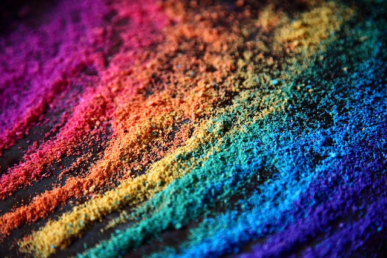

> [Unsplash](https://unsplash.com/ko/%EC%82%AC%EC%A7%84/%ED%8C%8C%EB%9E%80%EC%83%89%EA%B3%BC-%EB%B6%84%ED%99%8D%EC%83%89-%EC%A7%81%EB%AC%BC-%ED%81%B4%EB%A1%9C%EC%A6%88%EC%97%85-%EC%82%AC%EC%A7%84-QGQz-IBBl5w)의 Alexander Grey가 찍은 사진

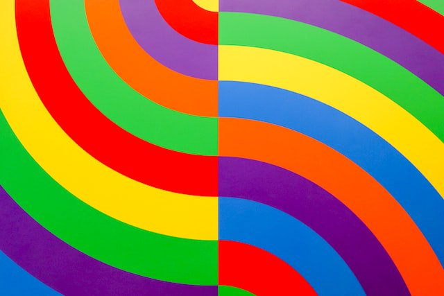

> [Unsplash](https://unsplash.com/ko/%EC%82%AC%EC%A7%84/%EB%82%98%EC%84%A0%ED%98%95-%EB%94%94%EC%9E%90%EC%9D%B8%EC%9D%98-%EC%97%AC%EB%9F%AC-%EA%B0%80%EC%A7%80-%EB%B9%9B%EA%B9%94%EC%9D%98-%EA%B7%B8%EB%A6%BC-xFdrt8YIoJc)의 Clark Van Der Beken가 찍은 사진

왼쪽에는 보라색, 빨간색, 주황색, 노란색, 아쿠아 그린, 하늘색, 진한 파란색의 무지개색 모래가 있는 이미지가 있습니다. 오른쪽에는 더 밝은, 여러 가지 색상의 무지개 패턴이 있습니다.

<br>

### 녹색맹

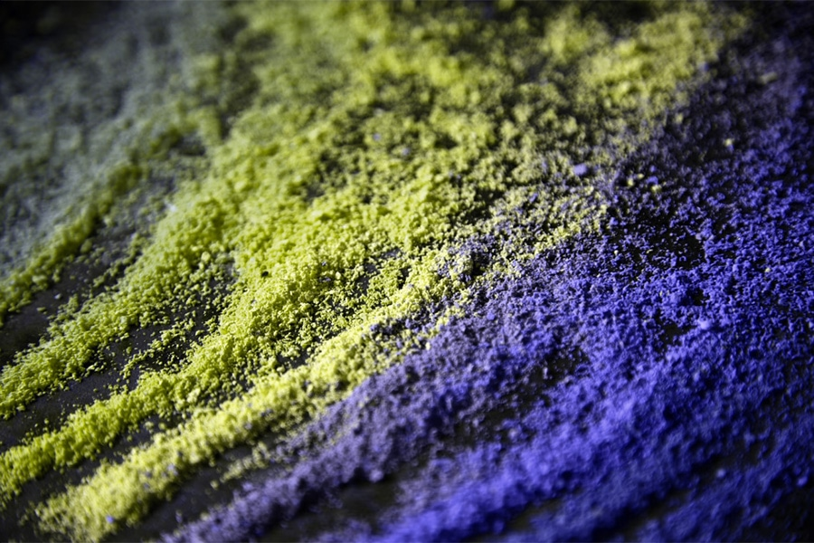

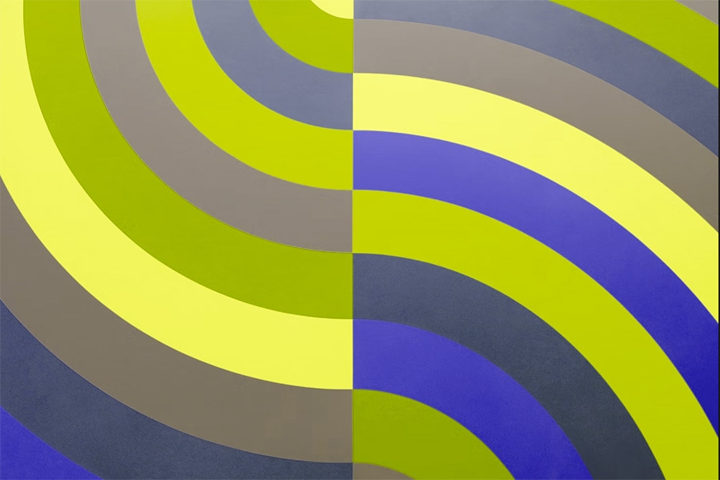

[Deuteranopia](https://www.color-blindness.com/deuteranopia-red-green-color-blindness/)(녹색맹)은 남성의 1%에서 5%, 여성의 0.35%에서 0.1%에서 발생합니다.

녹색맹이 있는 사람들은 초록빛에 대한 민감도가 감소되어 있습니다. 이 색맹 필터는 이러한 유형의 색맹이 어떻게 보일 수 있는지를 시뮬레이션합니다.

<br>

### 적색맹

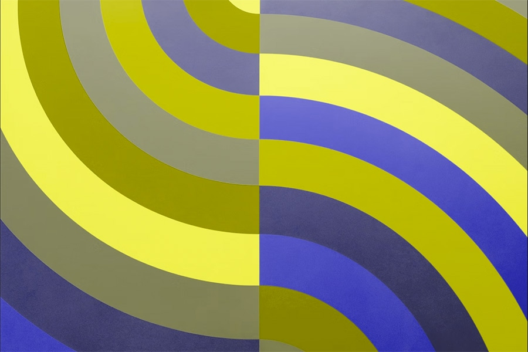

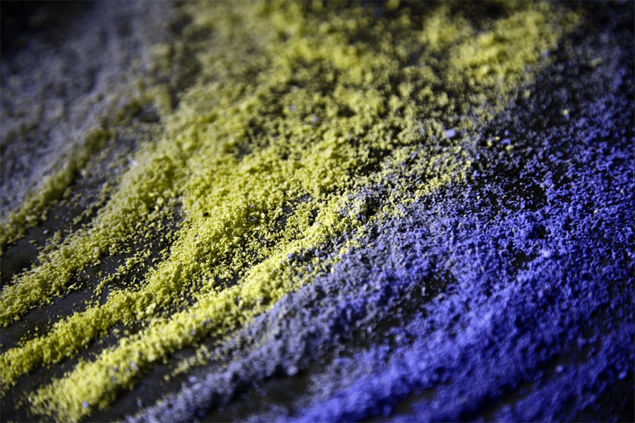

[Protanopia](https://www.color-blindness.com/protanopia-red-green-color-blindness/)(적색맹)는 남성의 1.01%에서 1.08%, 여성의 0.02%에서 0.03%에서 발생합니다.

적색맹이 있는 사람들은 빨간빛에 대한 민감도가 감소되어 있습니다. 이 색맹 필터는 이러한 유형의 색맹이 어떻게 보일 수 있는지를 시뮬레이션합니다.

<br>

### 색맹 또는 단색성

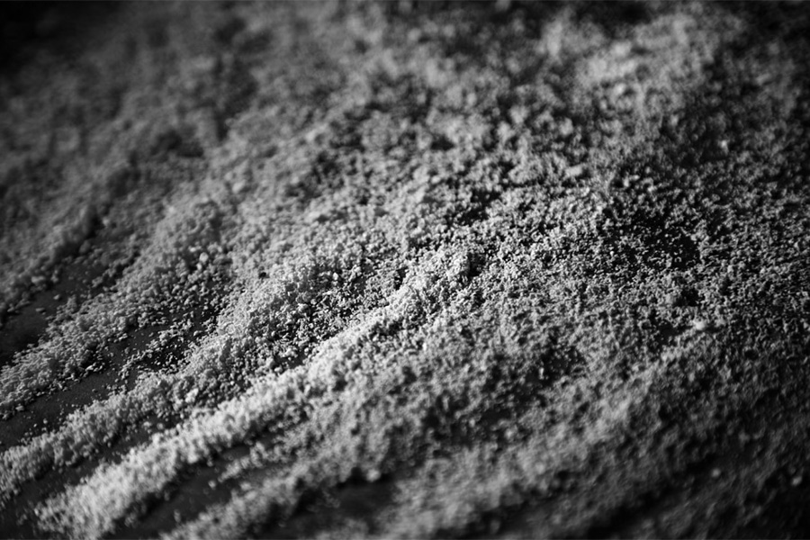

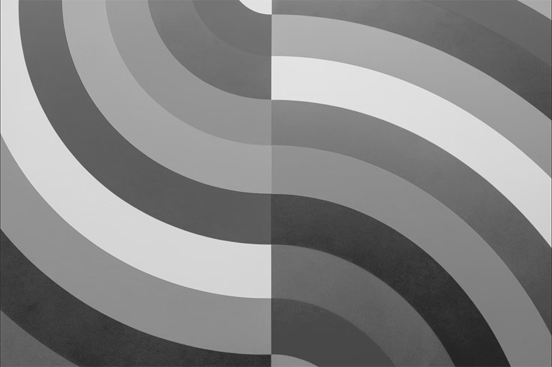

[Achromatopsia(색맹) 또는 Monochromatism(단색성)](https://www.color-blindness.com/2007/07/20/monochromacy-complete-color-blindness/)은 매우, 매우 드물게 발생합니다.

Achromatopsia 또는 Monochromatism이 있는 사람들은 빨간빛, 초록빛, 파란빛에 대한 인식이 거의 없습니다. 이 색맹 필터는 이러한 유형의 색맹이 어떻게 보일 수 있는지를 시뮬레이션합니다.

<br>

### 색상 대비 계산

색상 대비 공식은 대비를 결정하는 데 도움이 되는 색상의 [상대적 휘도](https://www.w3.org/TR/WCAG/#dfn-relative-luminance)를 사용하며, 이는 1에서 21 사이의 범위를 가질 수 있습니다. 이 공식은 종종 `[색상 값]:1`로 축약됩니다. 예를 들어, 순수한 흰색 배경의 순수한 검정색은 `21:1`로 가장 큰 색상 대비율을 가집니다.

```javascript
(L1 + 0.05) / (L2 + 0.05)
L1 is the relative luminance of the lighter color
L2 is the relative luminance of the darker colors
```

텍스트 이미지를 포함한 일반 크기의 텍스트는 색상에 대한 [WCAG 최소 요구사항](https://www.w3.org/WAI/WCAG21/Understanding/contrast-minimum.html)을 통과하기 위해 `4.5:1`의 색상 대비율을 가져야 합니다. 큰 크기의 텍스트와 필수 아이콘은 `3:1`의 색상 대비율을 가져야 합니다. 큰 크기의 텍스트는 최소 18pt / 24px 또는 14pt / 18.5px 굵은 글씨로 특징지어집니다. 로고와 장식용 요소는 이러한 색상 대비 요구사항에서 제외됩니다.

다행히도 색상 대비 계산을 대신해주는 많은 도구들이 있기 때문에 복잡한 수학은 필요하지 않습니다. [Adobe Color](https://color.adobe.com/ko/create/color-accessibility), [Color Contrast Analyzer](https://www.tpgi.com/color-contrast-checker/), [Leonardo](https://leonardocolor.io/#), [Chrome의 DevTools 색상 선택기](https://developer.chrome.com/docs/devtools/accessibility/reference?hl=ko#contrast)와 같은 도구들은 빠르게 색상 대비율을 알려주고 가장 포괄적인 색상 쌍과 팔레트를 만드는 데 도움이 되는 제안을 제공합니다.

[CODEPEN으로 예시 보기](https://codepen.io/web-dot-dev/pen/PoeKzWq)

<br>

## 색상 사용하기

좋은 색상 대비 수준이 없다면, 단어, 아이콘 및 기타 그래픽 요소를 [식별하기 어렵고](https://www.w3.org/WAI/WCAG22/Understanding/non-text-contrast.html), 디자인은 빠르게 접근 불가능해질 수 있습니다. 하지만 정보, 동작을 전달하거나 시각적 요소를 구분할 때 색상만을 사용할 수 없으므로 화면에서 [색상이 어떻게 사용되는지도](https://www.w3.org/WAI/WCAG22/Understanding/use-of-color.html) 주의를 기울이는 것이 중요합니다.

예를 들어, "[계속하려면 녹색 버튼을 클릭하세요](https://www.w3.org/WAI/WCAG22/Understanding/sensory-characteristics.html)"라고 하면서 버튼에 추가적인 내용이나 식별자를 생략한다면, 특정 유형의 색맹을 가진 사람들은 어떤 버튼을 클릭해야 할지 알기 어려울 것입니다. 마찬가지로, 많은 그래프, 차트, 표가 정보를 전달하기 위해 색상만을 사용합니다. 패턴, 텍스트, 아이콘과 같은 다른 식별자를 추가하는 것은 사람들이 콘텐츠를 이해하는 데 도움을 주는 중요한 요소입니다.

디지털 제품을 흑백조로 검토하는 것은 잠재적인 색상 문제를 빠르게 감지하는 좋은 방법입니다.

[CODEPEN으로 예시 보기](https://codepen.io/web-dot-dev/pen/rNvzLmd)

<br>

## 색상 중심의 미디어 쿼리

색상 대비율 확인과 화면에서의 색상 사용을 넘어서, 사용자에게 화면에 표시되는 내용에 대한 더 많은 제어권을 제공하는, 점점 더 인기 있고 지원되는 [미디어 쿼리](https://web.dev/learn/design/media-features#preferences)를 적용하는 것을 고려해야 합니다.

예를 들어, [`@prefers-color-scheme`](https://drafts.csswg.org/mediaqueries-5/#descdef-media-prefers-color-scheme) 미디어 쿼리를 사용하여 [광공포증](https://w3c.github.io/low-vision-a11y-tf/requirements.html#light-and-glare-sensitivity)이나 빛 민감성이 있는 사람들에게 도움이 될 수 있는 다크 테마를 만들 수 있습니다. 또한 [`@prefers-contrast`](https://drafts.csswg.org/mediaqueries-5/#descdef-media-prefers-contrast)를 사용하여 색각 이상이나 [대비 민감성](https://w3c.github.io/low-vision-a11y-tf/requirements.html#contrast-sensitivity)이 있는 사람들을 지원하는 고대비 테마를 만들 수도 있습니다.

> **Note:** 색상 접근성을 위해 고려해야 할 추가적인 미디어 쿼리와 운영체제 설정이 있지만, 이 모듈에서 언급된 두 가지보다는 지원이 훨씬 적습니다. 다양한 운영체제 접근성 설정에 대한 자세한 정보는 '[운영체제 및 브라우저 접근성 디스플레이 모드](https://www.a11yproject.com/posts/operating-system-and-browser-accessibility-display-modes/)'를 참고하세요.

<br>

### 선호 색상 구성표

**브라우저 지원**

- Chrome 76
- Edge 79
- Firefox 67
- Safari 12.1

> [출처](https://developer.mozilla.org/ko/docs/Web/CSS/@media/prefers-color-scheme)

미디어 쿼리 `@prefers-color-scheme`는 사용자가 방문하는 웹사이트나 앱의 라이트 또는 다크 테마 버전을 선택할 수 있게 해줍니다. 라이트 또는 다크 선호 설정을 변경하고 이 미디어 쿼리를 지원하는 브라우저로 이동하여 이 테마 변경을 실제로 확인할 수 있습니다. 다크 모드에 대한 [Mac](https://support.apple.com/ko-kr/guide/mac-help/mchl52e1c2d2/mac)과 [Windows](https://blogs.windows.com/windowsexperience/2016/08/08/windows-10-tip-personalize-your-pc-by-enabling-the-dark-theme/) 설명서를 검토해보세요.

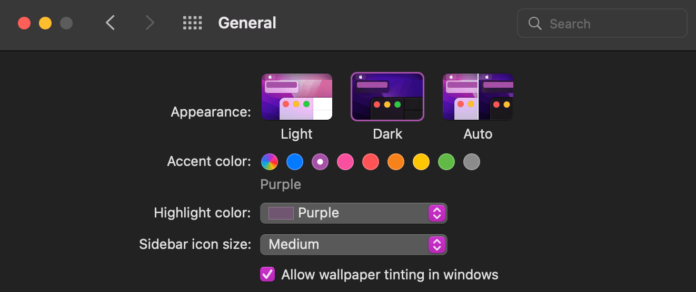

> macOS appearance에 대한 일반 설정

[CODEPEN으로 예시 보기](https://codepen.io/web-dot-dev/pen/ExLvNOw)

<details>
<summary>라이트 모드와 다크 모드 비교</summary>
<div markdown="1">


> 라이트 모드

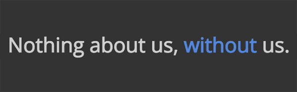

> 다크 모드

</div>
</details>

<br>

### 선호 대비

**브라우저 지원**

- Chrome 96
- Edge 96
- Firefox 101
- Safari 14.1

> [출처](https://developer.mozilla.org/ko/docs/Web/CSS/@media/prefers-contrast)

[`@prefers-contrast`](https://developer.mozilla.org/ko/docs/Web/CSS/@media/prefers-contrast) 미디어 쿼리는 고대비가 켜져 있는지 꺼져 있는지 확인하기 위해 사용자의 운영체제 설정을 확인합니다. 대비 선호 설정을 변경하고 이 미디어 쿼리를 지원하는 브라우저로 이동하여 이 테마 변경을 실제로 확인할 수 있습니다(Mac과 Windows의 대비 모드 설정).

[CODEPEN으로 예시 보기](https://codepen.io/web-dot-dev/pen/bGMrgNV)

<details>
<summary>일반 대비와 고대비를 비교</summary>
<div markdown="1">

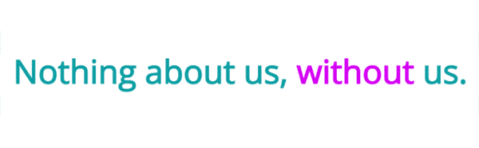

> 라이트 모드, 대비 선호 없음

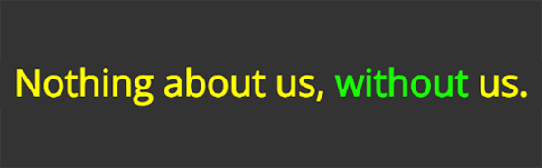

> 다크 모드, 고대비 선호

</div>
</details>

<br>

### 레이어 미디어 쿼리

사용자에게 더 많은 선택권을 주기 위해 여러 색상 중심의 미디어 쿼리를 사용할 수 있습니다. 이 예시에서는 `@prefers-color-scheme`와 `@prefers-contrast`를 함께 쌓아올렸습니다.

[CODEPEN 예시보기](https://codepen.io/web-dot-dev/pen/wvjqgaK)

<details>
<summary>색상과 대비를 모두 비교</summary>
<div markdown="1">


> 라이트 모드, 대비 선호 없음


> 다크 모드, 대비 선호 없음

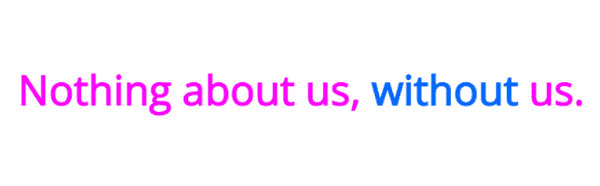

> 라이트 모드, 고대비 선호


> 다크 모드, 고대비 선호

</div>
</details>
