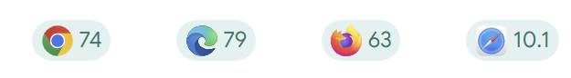

# 애니메이션과 모션

> 이 페이지에서는  
> 깜박임과 움직이는 콘텐츠  
> 움직임의 일시정지, 정지 또는 숨기기  
> 미디어 쿼리 사용하기  
> @prefers-reduced-motion  
> 움직임을 위한 점진적 향상  
> 계층화된 미디어 쿼리  
> 사용자가 선택할 수 있도록 허용하기  

 

자동차, 보트, 비행기를 타고 가다가 갑자기 세상이 회전하는 것을 느끼신 적이 있나요? 혹은 편두통이 너무 심해서 휴대폰이나 태블릿의 "즐거움을 주기 위한" 애니메이션이 오히려 고통을 주었던 적이 있나요? 아니면 평소에도 모든 종류의 움직임에 민감하신가요? 이러한 증상들은 다양한 유형의 전정 장애를 보여주는 예시입니다.

40세가 되면 성인의 35% 이상이 어떤 형태로든 [전정 기능 장애](https://vestibular.org/article/what-is-vestibular/about-vestibular-disorders/)를 경험하게 됩니다. 이는 일시적인 어지러움이나 편두통으로 인한 현기증으로 나타날 수 있으며, 때로는 영구적인 전정 장애로 이어질 수 있습니다.

현기증 유발 외에도, 많은 사람들은 움직이거나 깜박이는 콘텐츠, 또는 스크롤되는 내용이 주의를 산만하게 한다고 느낍니다. [ADHD](https://www.nimh.nih.gov/health/publications/attention-deficit-hyperactivity-disorder-in-children-and-teens-what-you-need-to-know)나 기타 주의력 결핍 장애가 있는 사람들의 경우, 애니메이션 요소로 인해 주의가 너무 분산되어 웹사이트나 앱을 방문한 본래 목적을 잊어버릴 수도 있습니다.

이 모듈에서는 모든 유형의 움직임 유발 장애를 가진 사람들을 더 잘 지원할 수 있는 다양한 방법들을 살펴보겠습니다.

## 깜박임과 움직이는 콘텐츠

애니메이션과 모션을 제작할 때 요소의 움직임이 과도한지 자문해 보세요. 예를 들어, 어두운 곳에서 밝은 곳으로 깜박이는 색상이나 화면의 빠른 움직임은 광과민성 간질이 있는 사람에게 발작을 일으킬 수 있습니다. [간질 환자의 3%](https://www.epilepsy.com/what-is-epilepsy/seizure-triggers/photosensitivity)가 광과민성을 앓고 있는 것으로 추산되며, 이는 여성과 젊은 사람들에게 더 흔합니다.

[깜박임에 대한 WCAG의 지침](https://www.w3.org/TR/WCAG22/#three-flashes-or-below-threshold)은 다음 사항을 권장하지 않습니다:

- 1초에 3번 이상 깜박임
- [일반 깜박임 및 붉은색 깜박임 임계값](https://www.w3.org/TR/WCAG22/#dfn-general-flash-and-red-flash-thresholds) 아래에서의 깜박임

이러한 깜박임은 기껏해야 웹 페이지를 사용할 수 없게 만들거나 최악의 경우 질병으로 이어질 수 있습니다.

극단적인 움직임의 경우 [광과민성 간질 분석 도구(PEAT)](https://trace.umd.edu/peat/)를 사용하여 테스트하는 것이 중요합니다. PEAT는 화면의 콘텐츠, 비디오 또는 애니메이션이 발작을 일으킬 가능성이 있는지 식별하는 무료 도구입니다. 모든 콘텐츠를 PEAT로 평가할 필요는 없지만, 안전을 위해 밝은 배경색과 어두운 배경색 사이에 깜박이거나 빠른 전환이 포함된 콘텐츠를 평가해야 합니다.

애니메이션과 모션에 관해 스스로에게 물어봐야 할 또 다른 질문은 요소의 움직임이 화면의 콘텐츠나 동작을 이해하는 데 필수적인지 여부입니다. 꼭 필요한 것이 아니라면 제작하거나 디자인하는 요소에서 모든 움직임-미세한 움직임이라도 포함-을 제거하는 것이 좋습니다.

요소의 움직임이 필수적이지는 않지만 사용자의 전반적인 경험을 향상시킬 수 있다고 생각하거나 다른 이유로 움직임을 제거할 수 없다고 가정해 보겠습니다. 이 경우 [모션에 대한 WCAG의 지침](https://www.w3.org/WAI/WCAG21/Understanding/pause-stop-hide.html)을 따라야 합니다. 지침에는 자동으로 시작되고 5초 이상 지속되며 다른 페이지 요소의 일부인 필수적이지 않은 이동, 깜박임 또는 스크롤 요소에 대해 사용자가 이동을 일시 중지, 중지 또는 숨길 수 있는 옵션을 구축해야 한다고 명시되어 있습니다.

 

## 움직임의 일시정지, 정지 또는 숨기기

사용자가 잠재적으로 문제가 될 수 있는 모션 애니메이션을 끌 수 있도록 페이지에 일시 중지, 중지 또는 숨기기 메커니즘을 추가하세요. 이는 화면 단위 또는 요소 단위로 구현할 수 있습니다.

예를 들어 여러분의 디지털 제품에 많은 애니메이션이 포함되어 있다고 가정해 보겠습니다. 사용자가 경험을 직접 제어할 수 있도록 접근성이 고려된 JavaScript 토글을 추가하는 것을 고려해 보세요. "모션 끄기" 버튼을 토글하면 해당 화면과 다른 모든 화면의 애니메이션이 정지됩니다.

[CODEPEN으로 예시 보기](https://codepen.io/web-dot-dev/pen/xxjpBGE)

 

## 미디어 쿼리 사용하기

애니메이션을 선택적으로 사용하고, 사용자에게 움직임을 일시 중지, 중지, 숨길 수 있는 옵션을 제공하며, 무한 애니메이션 루프를 피하는 것 외에도 움직임 중심의 미디어 쿼리를 추가하는 것을 고려할 수 있습니다. 이렇게 하면 화면에 표시되는 내용에 대해 사용자에게 더 많은 선택권을 제공할 수 있습니다.

 

### @prefers-reduced-motion

[color 모듈](https://web.dev/learn/accessibility/color-contrast)의 색상 중심 미디어 쿼리와 유사하게 `@prefers-reduced-motion` 미디어 쿼리는 애니메이션과 관련된 [사용자의 OS 설정](https://developer.mozilla.org/docs/Web/CSS/@media/prefers-reduced-motion#user_preferences)을 확인합니다.

사용자는 모션을 줄이도록 디스플레이 환경설정을 지정할 수 있습니다. 이러한 설정은 운영 체제마다 다르며, 긍정적이거나 부정적으로 표현될 수 있습니다. [@prefers-reduced-motion](https://web.dev/articles/prefers-reduced-motion)을 사용하면 이러한 환경설정을 존중하는 사이트를 디자인할 수 있습니다.

브라우저 지원  [출처](https://developer.mozilla.org/en-US/docs/Web/CSS/@media/prefers-reduced-motion)

macOS와 Android에서는 사용자가 모션을 줄이기 위해 설정을 켭니다. macOS에서는 설정 > 접근성 > 디스플레이에서 **모션 줄이기**를 설정할 수 있습니다. Android의 설정은 **애니메이션 제거**입니다. Windows에서는 **애니메이션 표시**라는 긍정적인 설정이 기본적으로 켜져 있습니다. 모션을 줄이려면 사용자가 이 설정을 꺼야 합니다.

> **Note**: 각 인터페이스마다 다른 용어를 사용하므로, 얼마나 많은 애니메이션이 과도한지 추측하기보다는 사용자가 직접 선택할 수 있도록 하는 것이 좋습니다. 이는 상황에 따라 다를 수 있습니다.

[CODEPEN으로 예시 보기](https://codepen.io/web-dot-dev/pen/VwxyReM)

또는 다음 예제들에서 보여주듯이, 무한 루프로 재생하는 대신 모든 애니메이션이 5초 이내에 움직임을 멈추도록 코딩할 수 있습니다.

 

### 움직임을 위한 점진적 향상

디자이너와 개발자로서 우리는 기본 모션 상태와 표시할 움직임의 정도를 포함하여 많은 선택을 해야 합니다. 모션에 대한 마지막 예시를 다시 살펴보세요.

화면의 내용을 이해하는 데 애니메이션이 필요하지 않다고 판단된다고 가정해 보겠습니다. 이 경우 기본 상태를 전체 모션 버전 대신 축소된 모션 애니메이션으로 설정할 수 있습니다. 사용자가 특별히 애니메이션을 요청하지 않는 한 애니메이션은 꺼져 있게 됩니다.

> **Caution**: 사용 가능한 모션 환경설정은 운영 체제에 따라 다릅니다. 일부는 애니메이션을 선택하도록 되어 있고, 다른 일부는 애니메이션을 해제하도록 되어 있습니다.

발작, 전정 장애 및 기타 시각 장애가 있는 사람들에게 어느 정도의 움직임이 문제를 일으킬지 예측할 수 없습니다. 화면의 작은 움직임조차도 현기증, 시야 흐림 또는 더 심각한 증상을 유발할 수 있습니다. 따라서 다음 예시에서는 기본적으로 애니메이션을 사용하지 않도록 설정합니다.

[CODEPEN으로 예시 보기](https://codepen.io/web-dot-dev/pen/qBYpvam)

 

### 계층화된 미디어 쿼리

여러 미디어 쿼리를 사용하여 사용자에게 더 많은 선택권을 제공할 수 있습니다. `@prefers-color-scheme`, `@prefers-contrast`, `@prefers-reduced-motion`을 모두 함께 사용해 보겠습니다.

[CODEPEN으로 예시 보기](https://codepen.io/web-dot-dev/pen/wvjpOzR)

 

## 사용자가 선택할 수 있도록 허용하기

디지털 제품에 애니메이션을 넣어 사용자를 즐겁게 하는 것도 좋지만, 이러한 디자인이 일부 사용자들에게 영향을 미칠 수 있다는 점을 반드시 기억해야 합니다. 모션 민감도는 누구에게나 영향을 미칠 수 있으며, 가벼운 불편함에서부터 심각한 질병이나 발작까지 유발할 수 있습니다.

얼마나 많은 모션이 과도한지 추측하는 대신, 다양한 도구를 사용하여 사용자가 자신에게 가장 적합한 것을 선택할 수 있게 해야 합니다. 예를 들어 사이트나 웹 앱에서 애니메이션을 켜고 끌 수 있는 토글을 추가하세요. 이러한 토글은 기본값을 **꺼짐**으로 설정하는 것을 고려하세요.
