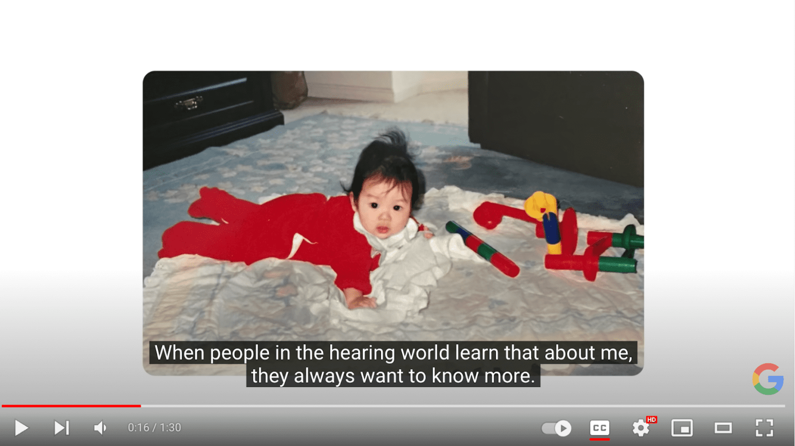
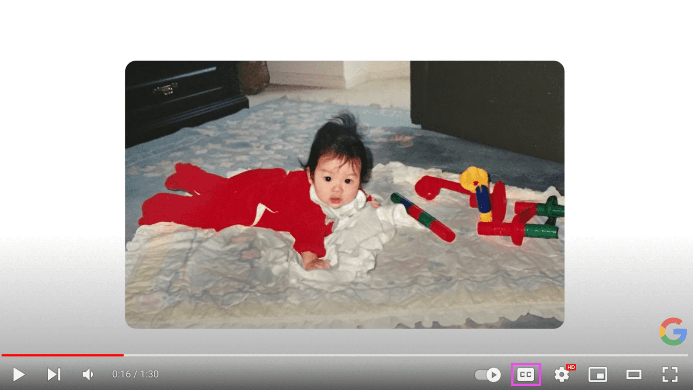
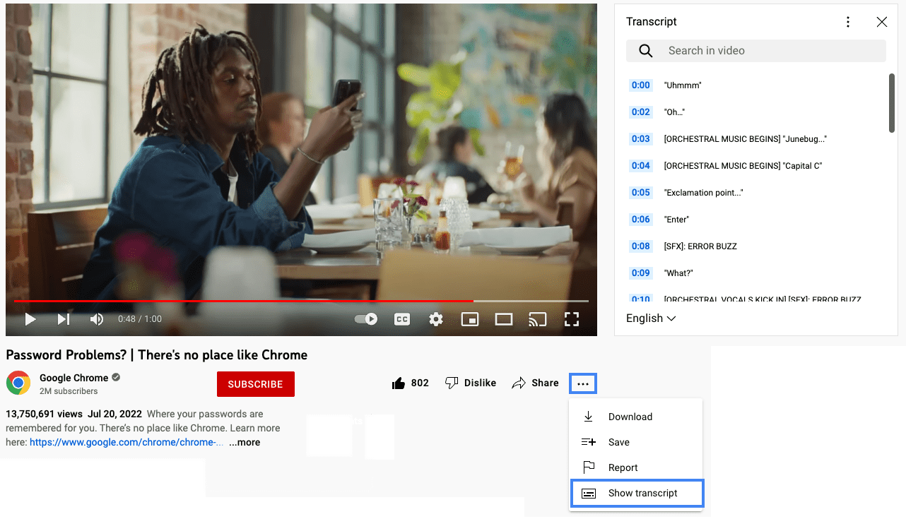

# 비디오와 오디오

> 이 페이지에서는  
> 대체 미디어 유형  
> 자막  
> 대본  
> 오디오 설명  
> 수어 통역  

헤드폰을 찾지 못해서 자막을 켜고 라이브 이벤트를 시청한 적이 있나요? 또는 좋아하는 팟캐스트의 마지막 요점을 잘 이해하지 못해 대신 대본을 읽어본 적이 있나요? 그렇다면 오디오와 비디오 콘텐츠를 접근할 수 있는 대체 방법의 중요성과 편리함을 이해하실 것입니다.

회사나 조직에서 맡은 역할이 오디오나 비디오 콘텐츠를 직접 제작하는 것이 아니더라도, [미디어 접근성 요구사항의 기본](https://www.w3.org/WAI/WCAG21/Understanding/time-based-media)을 아는 것은 중요합니다. 이러한 지식은 전 세계의 수많은 청각 장애인이나 시각 장애인을 포함하여, 다양한 환경적, 감각적 요구사항을 가진 사용자들을 수용할 수 있는 적절한 레이아웃과 기능을 설계하고 구축하는 데 도움이 될 것입니다.

 

## 대체 미디어 유형

장애인의 미디어 필요성을 지원하기 위해 대체 미디어 유형이 개발되었습니다. 이를 통해 사람들이 오디오와 비디오 콘텐츠를 이용할 때 선택할 수 있는 추가 형식을 제공받을 수 있습니다.

미디어 파일에 [포함해야 하는 대체 미디어 유형](https://www.w3.org/WAI/media/av/planning/#wcag-standard)은 다음 사항들에 따라 달라집니다:

- 지원하는 미디어 유형 (오디오 전용, 비디오 전용 또는 오디오가 포함된 비디오(멀티미디어) 형식)
- 미디어가 실시간인지 사전 녹화된 것인지 여부
- 목표로 하는 WCAG 준수 버전 및 수준
- 기타 미디어 관련 사용자 요구사항

웹사이트와 앱에서 [접근 가능한 오디오 및 비디오 콘텐츠](https://www.w3.org/WAI/media/av/)를 만들기 위한 네 가지 주요 대체 미디어 유형이 있습니다: [자막](https://web.dev/learn/accessibility/video-audio#captions), [대본](https://web.dev/learn/accessibility/video-audio#transcripts), [오디오 설명](https://web.dev/learn/accessibility/video-audio#audio_descriptions), [수어 통역](https://web.dev/learn/accessibility/video-audio#sign_language_interpretation)이 그것입니다.

 

## 자막

가장 널리 사용되는 대체 미디어 유형 중 하나는 [자막](https://www.w3.org/WAI/media/av/captions/)입니다. 자막은 음성을 듣거나 이해할 수 없는 사람들을 위해 멀티미디어 콘텐츠와 동기화된 문자 텍스트입니다. 주 오디오 트랙과 동일한 언어로 제공되며, 음향 효과, 배경 소음, 중요한 음악 등 필수적인 비음성 정보도 포함합니다.

자막은 농인, 난청인 또는 인지 장애가 있는 사람들에게 도움이 될 뿐만 아니라 다른 많은 사람들에게도 유용합니다.

자막은 개방형과 폐쇄형의 두 가지 형태로 제공됩니다:

- 폐쇄 자막(CC)은 시청자가 켜거나 끌 수 있는 비디오 위의 텍스트로, 미디어 플레이어에 따라 사용자의 필요에 맞게 스타일을 지정할 수 있습니다.
- 개방 자막(OC)은 비디오에 직접 삽입된 텍스트로, 끄거나 스타일을 변경할 수 없습니다.

상황이나 멀티미디어 시청 방식에 따라 선호되는 방식이 다를 수 있습니다.

사람들은 종종 자막(captions)과 번역자막(subtitles)을 혼동하지만, 이 둘은 같은 것이 아닙니다. 둘 다 멀티미디어 콘텐츠와 동기화된 텍스트이며 주로 화면 하단에 표시됩니다. 자막은 장애인을 위해 대화와 기타 필수적인 소리를 문자로 옮긴 것으로 볼 수 있습니다. 반면 번역자막은 외국어 영화를 볼 때처럼, 소리는 들을 수 있지만 그 내용을 이해하지 못하는 사람들을 위한 시각적 텍스트입니다.

> **Note**: 자막과 번역자막에 대한 정의는 지역에 따라 차이가 있을 수 있으므로, 해당 지역에서 사용되는 용어를 확인하시기 바랍니다.

| Features                             | Subtitles | Closed captions | Open captions |
| ------------------------------------ | --------- | --------------- | ------------- |
| Visual text matches audio track      | No        | Yes             | Yes           |
| Includes essential background sounds | No        | Yes             | Yes           |
| Ability to toggle on/off             | Yes       | Yes             | No            |

[YOUTUBE 영상 보기](https://youtu.be/pXc_w49fsmI)

_Google — A CODA Story 동영상에서 자막의 예시를 확인해보세요. 이 비디오의 폐쇄 자막을 보려면 CC 버튼을 **켜기**로 전환하세요._

자막이 있는 경우와 없는 경우의 비디오 스크린샷 비교

 

## 대본

자막과 밀접한 관련이 있는 [대본](https://www.w3.org/WAI/media/av/transcripts/)은 미디어의 모든 필수적인 단어, 소리 및 중요한 시각적 정보를 담은 상세한 텍스트 문서입니다. 대본은 주로 난청인이나 농인에게 도움이 되며, 설명이 포함된 대본은 시청각장애인에게 도움이 됩니다.

대본은 또한 인지 장애가 있는 사람이나 자신의 속도에 맞춰 콘텐츠를 검토하고 싶은 사람에게도 유용합니다.

일반적으로 대본은 자막보다 더 자세하지만, 형식과 목적은 매우 유사합니다. 너무 유사하기 때문에 많은 사람들이 먼저 미디어에 자막을 추가하고 이를 내보낸 다음, 이를 대본 작성의 기초로 활용합니다. 자막을 재활용하여 대본을 만드는 것이 처음부터 새로 작성하는 것보다 시간을 절약할 수 있습니다.

검색 봇은 자막은 읽을 수 없지만 텍스트 대본은 크롤링할 수 있습니다. 미디어 파일에 대본을 포함하면 검색 엔진 최적화에 도움이 됩니다. 이는 중복 콘텐츠가 사용자에게 혼란을 주거나 검색 엔진 알고리즘에서 불이익을 받지 않는 흔치 않은 예외 중 하나입니다.

모든 미디어 플레이어는 대본을 각기 다른 방식으로 다룹니다. 일부 제공업체의 미디어 플레이어에는 이 기능이 내장되어 있지 않을 수 있으며, 내장되어 있더라도 일부 사용자는 대본 인터페이스에 접근하지 못할 수 있습니다. 다음과 같은 방법으로 모든 사용자가 대본을 이용할 수 있도록 보장할 수 있습니다:

- 대본 텍스트를 비디오가 삽입된 페이지에 직접 문맥에 맞게 포함
- 대본이 포함된 접근 가능한 PDF 링크 추가
- 다른 페이지에 있는 사본으로 연결
- YouTube나 Vimeo 같은 미디어 플레이어 플랫폼의 비디오 설명에 대본 위치 링크 포함

예를 들어, YouTube에서 [_Password Problems? | There's no place like Chrome_](https://www.youtube.com/watch?v=SlGuvC5nnTA) 영상을 시청하고 대본의 예시를 살펴보세요.

*비디오 제목 아래에서 *more_horiz*를 클릭하고 드롭다운 메뉴에서 **대본 표시**를 선택하세요. 대본은 화면 크기에 따라 비디오의 오른쪽이나 아래쪽에 표시됩니다.*

 

## 오디오 설명

장애인을 지원하기 위한 또 다른 대체 미디어는 [오디오 설명](https://www.w3.org/WAI/media/av/description/)입니다. 이 유형의 대체 미디어는 내레이터를 활용하여 시각적 콘텐츠를 볼 수 없는 사람들에게 중요한 시각 정보를 설명합니다. 이러한 설명에는 얼굴 표정, 말로 표현되지 않는 행동, 비디오 전용 및 멀티미디어 콘텐츠의 배경 환경과 같은 비언어적 정보가 포함됩니다.

때로는 시청자와 공유해야 할 정보의 양이 많아서 오디오 설명이 매우 상세해야 하는 경우가 있습니다. 오디오 설명을 위한 자연스러운 휴지가 비디오에 충분하지 않은 경우에는 확장 오디오 설명이 사용됩니다. 확장 오디오 설명에서는 비디오의 나머지 부분을 재생하기 전에 내레이터가 모든 정보를 전달할 수 있도록 충분한 시간을 확보하기 위해 비디오가 일시 정지됩니다.

오디오 설명과 확장 오디오 설명은 시각장애인이나 저시력자에게 도움이 될 뿐만 아니라 일부 인지장애가 있는 사람들에게도 도움이 될 수 있습니다.

[YOUTUBE 영상 보기](https://youtu.be/fNq5jWyEeWo)

_다음은 오디오 설명이 포함된 일러스트레이션 비디오의 예시입니다: _`[Audio Described]` Get started with Lookout from Google | Android\*\*

 

## 수어 통역

접할 수 있는 또 다른 주요 대체 미디어 유형은 [수어 통역](https://www.w3.org/WAI/media/av/sign-languages/)입니다. 이는 통역사가 수어를 사용하여 오디오 전용 또는 멀티미디어 콘텐츠의 청각적 부분을 전달하는 것을 말합니다. 수어는 농인들의 모국어이자 가장 유창하게 사용하는 언어이기 때문에 많은 농인들에게 매우 중요합니다.

수어 통역은 문자로 된 문서보다 더 풍부한 표현이 가능하고 상세하여, 자막이나 대본만으로는 얻을 수 없는 더욱 풍부한 경험을 제공합니다.

다만, 수어 통역은 많은 기관에서 시간과 비용이 많이 소요되는 작업입니다. 미디어에 수어 통역을 추가할 시간과 예산이 있다 하더라도, 전 세계적으로 [300개 이상의 서로 다른 수어](https://en.wikipedia.org/wiki/List_of_sign_languages)가 존재합니다. 따라서 하나의 수어 통역만으로는 전 세계 시청자를 지원하기에 충분하지 않습니다.

[YOUTUBE 영상 보기](https://youtu.be/MbHuSHGZf5U)

_Google Presents: Search On '22 영상에서 수어 통역사가 Google의 지속가능성 이야기를 어떻게 전달했는지 살펴보세요._
