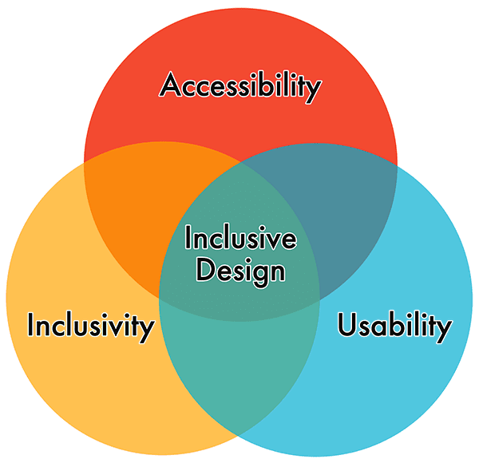
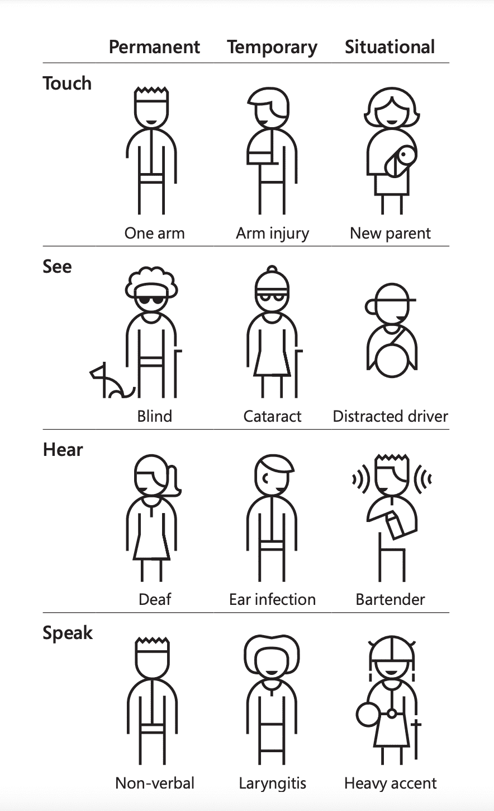
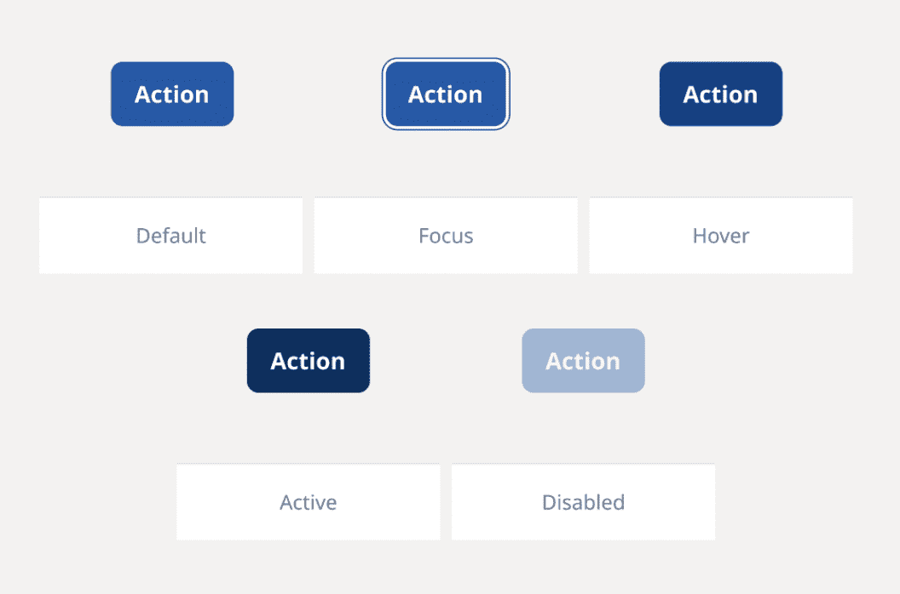
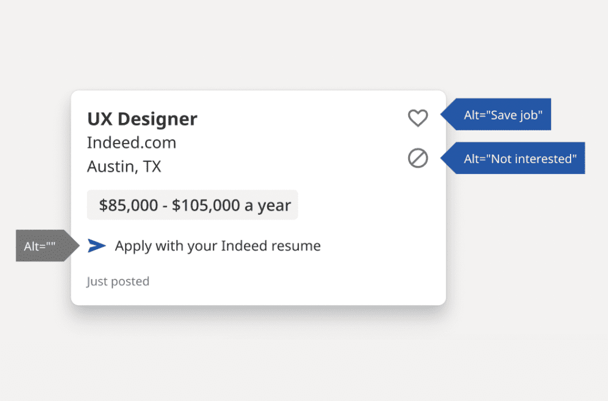
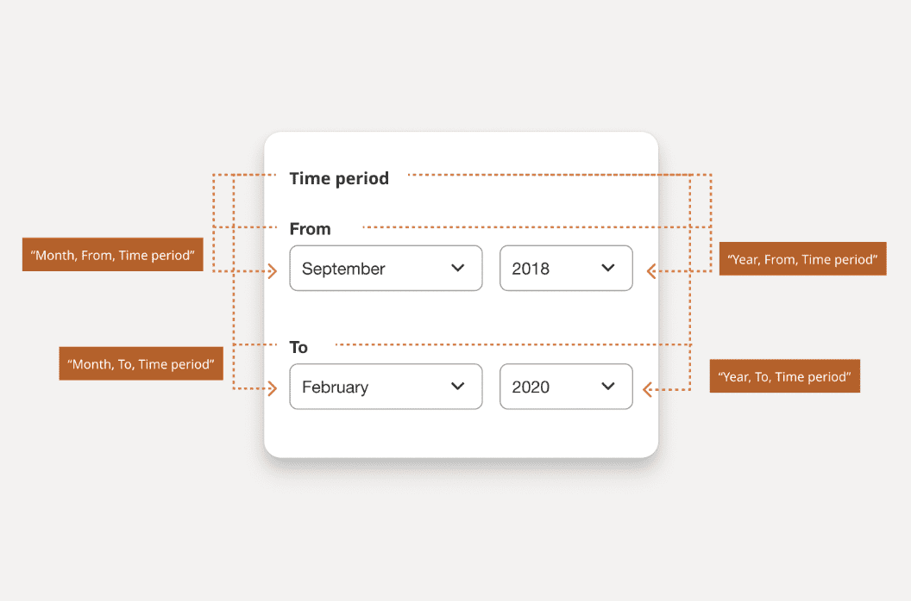

# 디자인과 사용자 경험

당신이 가장 좋아하는 웹사이트나 앱을 생각해보세요. 무엇이 그것을 당신의 가장 좋아하는 것으로 만들었나요? 이제, 싫어하는 웹사이트나 앱을 생각해보세요. 그것의 어떤 점이 마음에 들지 않나요? 사용자들이 당신의 디자인과 상호작용하는 방식과 웹사이트 및 앱에서의 경험은 다양할 수 있습니다.

그 경험은 하루 중 시간대, 사용하는 기기의 종류, 전날 밤 충분한 수면을 취했는지, 건강상태가 좋지 않은지, 보조 기술을 사용하고 있는지 등 다양한 요소에 따라 달라질 수 있습니다. 전 세계 약 80억 명의 인구를 고려할 때, 사람들이 당신의 디자인을 사용하고 경험하는 방식의 가능성은 무한합니다.

 

## 포용적 디자인

어떻게 모든 잠재적 사용자의 요구사항을 한 번에 해결할 수 있을까요? 여기서 포용적 디자인이 등장합니다. 포용적 디자인은 포용성, 사용성, 접근성을 하나로 통합하는 인간 중심적 접근 방식을 활용합니다.

그리고 가능한 한 많은 사람들이 사용할 수 있는 단일 디자인에 중점을 두는 유니버설 디자인과 달리, 포용적 디자인 원칙은 특정 개인이나 사용 사례를 위한 디자인을 만들고, 이를 다른 사람들에게 확장하는 것에 중점을 둡니다.

다음은 접근성에 초점을 맞춘 7가지 포용적 디자인 원칙입니다:

1. 동등한 경험 제공: 인터페이스가 모든 사용자에게 동등한 경험을 제공하도록 보장하여, 콘텐츠의 품질을 저하시키지 않으면서 사용자가 자신의 필요에 맞는 방식으로 작업을 수행할 수 있도록 합니다.
2. 상황 고려: 사용자의 상황에 관계없이 인터페이스가 가치 있는 경험을 제공하도록 보장합니다.
3. 일관성 유지: 익숙한 관례를 사용하고 이를 논리적인 방식으로 적용합니다.
4. 제어권 제공: 사용자가 선호하는 방식으로 콘텐츠에 접근하고 상호작용할 수 있도록 보장합니다.
5. 선택권 제공: 특히 복잡하거나 비표준적인 작업의 경우, 사용자가 작업을 완료할 수 있는 다양한 방법을 제공하는 것을 고려합니다.
6. 콘텐츠 우선순위 지정: 핵심 작업, 기능, 정보를 콘텐츠와 레이아웃 내에서 선호하는 순서로 배치하여 사용자가 이에 집중할 수 있도록 돕습니다.
7. 가치 더하기: 기능의 목적과 중요성, 그리고 이러한 기능이 다양한 사용자의 경험을 어떻게 향상시키는지 고려합니다.

 

## 페르소나

새로운 디자인이나 기능을 개발할 때, 많은 팀들은 그 과정을 안내하는 사용자 [페르소나](https://www.nngroup.com/articles/persona/)에 의존합니다. 페르소나는 여러분의 디지털 제품을 사용하는 가상의 캐릭터로, 주로 정량적 및 정성적 사용자 연구를 바탕으로 만들어집니다.

페르소나는 또한 디자인과 개발 과정 전반에 걸쳐 이러한 기능들을 신속하고 저렴한 방법으로 테스트하고 우선순위를 정할 수 있게 해줍니다. 페르소나는 대화에 실제 세계의 고려사항을 추가함으로써 전략을 조율하고 특정 사용자 그룹에 초점을 맞춘 목표를 수립하는 데 도움을 주어, 사이트 구성 요소에 관한 의사결정에 집중할 수 있도록 돕습니다.

 

### 장애 요소의 통합

> "사람들은 모두 다릅니다. 저는 단지 제 경험만을 말할 수 있을 뿐입니다. 한 명의 청각장애인을 만났다면, 그것은 단지 한 명의 청각장애인을 만난 것일 뿐—우리 모두를 대표하는 것은 아닙니다."
>
> _ID24 강연 '[청각장애인 기술: 과거에서 미래로의 여행](https://www.youtube.com/watch?v=yrwKWtJdZ_c)'에서 메릴 에반스의 말_

|                      |
| ----------------------------------------------------------------------------------------------- |
| [_마이크로소프트의 포용적 101 툴킷_](https://inclusive.microsoft.design/)_의 페르소나 스펙트럼_ |

페르소나는 장애인을 페르소나에 포함시킴으로써 포용적 디자인 도구로 사용될 수 있습니다. 이를 실현하는 방법은 다양합니다. [장애에 특화된 페르소나](https://accessibility.blog.gov.uk/2016/09/02/dos-and-donts-on-designing-for-accessibility/)를 만들거나, 기존 사용자 페르소나에 장애 요소를 추가하거나, 또는 상황적, 일시적, 영구적 장애의 역동적 현실을 반영하는 페르소나 스펙트럼을 만들 수도 있습니다.

장애인을 페르소나에 통합하는 방식이 어떠하든, 이는 실제 인물이나 고정관념을 바탕으로 해서는 안 됩니다. 그리고 페르소나는 결코 사용자 테스트를 대체할 수 없습니다.

페르소나: 제인 베넷 
특정 사용 사례를 지원하는 페르소나의 예시를 살펴보세요. 

 

- <b>이름</b>: 제인 베넷
- <b>나이</b>: 57세
- <b>위치</b>: 영국 에섹스
- <b>직업</b>: UX 엔지니어
- <b>장애</b>: 조기 발병 파킨슨병(YOPD)으로 인한 손 떨림
- <b>목표</b>: 음성-텍스트 입력을 사용하여 코드 제안 추가를 더 쉽게 하기; 최소한의 키 입력으로 자전거 장비를 온라인에서 찾기
- <b>불편 사항</b>: 키보드 전용 지원이 부족한 웹사이트들; 터치 상호작용 영역이 작은 디자인용 앱들

UX 엔지니어로서 제인은 회사 사이트의 관련성을 유지하는 데 필수적인 페이지들을 디자인하고 구축합니다. 그녀는 하루 종일 많은 팀원들을 지원합니다. 그녀는 기술적 문제를 해결하는 전문가이며, 예상치 못한 문제가 발생할 때마다 부서 내 모든 사람들이 찾는 해결사입니다.

떨림으로 인해 미세 운동 기능을 잃어가면서 마우스 사용이 점점 더 어려워지고 있습니다. 그녀는 웹을 탐색하는 데 키보드에 점점 더 많이 의존하고 있습니다. 제인은 항상 체력 관리에 헌신적이었습니다. 그녀는 도로 경주와 BMX를 좋아합니다. 이런 상황에서 작년에 조기 발병 파킨슨병 진단을 받은 것은 그녀에게 더욱 큰 타격이었습니다.

 

### 장애 시뮬레이터

[페르소나를 모방하거나 보완하기](https://accessibility.blog.gov.uk/2019/02/11/using-persona-profiles-to-test-accessibility/) 위해 장애 시뮬레이터를 사용할 때는 매우 신중해야 합니다.

장애 시뮬레이터는 동정심이나 공감을 불러일으킬 수 있다는 점에서 양날의 검과 같습니다—이는 개인, 시뮬레이터가 사용되는 맥락, 그리고 다른 많은 통제 불가능한 요소들에 따라 달라질 수 있습니다. 많은 접근성 옹호자들은 [장애 시뮬레이터 도구 사용을 반대](https://sheribyrnehaber.medium.com/simulating-disabilities-d03986e05c1b)하며, 대신 장애인들이 직접 제작한 영화, 데모, 튜토리얼 및 기타 콘텐츠를 찾아보고 그들의 경험을 직접 배우는 것을 권장합니다.

> "우리는 어떤 시뮬레이션 활동도 시각을 가진 사람들이 마음과 머리로 이해하기를 바라는 가장 중요한 이해의 일부를 완전히 전달할 수 없다는 사실을 완전히 인정해야 합니다. 시각장애는 우리를 정의하는 특성이 아니며, 시각장애에 대한 오해와 낮은 기대치가 우리의 가장 큰 장애물입니다.
>
> 이러한 오해들은 우리가 완전히 참여하는 것을 막는 인위적인 장벽을 만들고, 이러한 거짓된 제한들이 쌓여 우리를 제약하는 것이 됩니다."
>
> [마크 리코보노](https://nfb.org/sites/default/files/images/nfb/publications/bm/bm17/bm1704/bm170402.htm), 전미 시각장애인 연합회 회장

 

### 접근성 휴리스틱

페르소나와 디자인을 구축할 때 [휴리스틱](https://www.nngroup.com/articles/how-to-conduct-a-heuristic-evaluation/)을 워크플로우에 추가하는 것을 고려하세요. 휴리스틱은 1990년 야콥 닐슨과 롤프 몰리히가 소개한 상호작용 디자인을 위한 규칙입니다. 이 열 가지 원칙은 사용성 엔지니어링 분야의 수년간의 경험을 바탕으로 개발되었으며, 그 이후로 디자인과 인간-컴퓨터 상호작용 프로그램에서 계속 사용되어 왔습니다.

2019년으로 빠르게 넘어가서, Deque의 디자인 팀은 [디지털 접근성에 초점을 맞춘 새로운 휴리스틱](https://www.deque.com/blog/supporting-the-design-phase-with-accessibility-heuristics-evaluations/) 세트를 만들고 공유했습니다. 그들의 연구에 따르면, 웹사이트나 앱의 접근성 버그 중 최대 67%가 디자인 과정에서 접근성을 고려함으로써 피할 수 있다고 합니다. 이는 단 한 줄의 코드도 작성하기 전에 만들 수 있는 엄청난 영향입니다.

원래의 휴리스틱 세트와 비슷하게, 디자인을 계획할 때 고려해야 할 열 가지 접근성 휴리스틱이 있습니다:

1. _상호작용 방법과 형태_: 사용자가 선택한 입력 방식(마우스, 키보드, 터치 등)을 사용하여 시스템과 효율적으로 상호작용할 수 있습니다.

2. _탐색과 길찾기_: 사용자가 언제나 시스템 내에서 콘텐츠를 탐색하고 찾을 수 있으며, 자신의 위치를 파악할 수 있습니다.

3. _구조와 의미론_: 사용자가 각 페이지의 콘텐츠 구조를 이해하고 시스템 내에서 어떻게 작동해야 하는지 이해할 수 있습니다.

4. _오류 예방과 상태_: 상호작용 컨트롤에는 실수를 방지하는 데 도움이 되는 지속적이고 의미 있는 지침이 있으며, 오류가 발생할 때마다 문제가 무엇이고 어떻게 해결할 수 있는지 명확한 오류 상태를 사용자에게 제공합니다.

5. _대비와 가독성_: 사용자가 텍스트와 기타 의미 있는 정보를 쉽게 구별하고 읽을 수 있습니다.

6. _언어와 읽기 쉬움_: 사용자가 콘텐츠를 쉽게 읽고 이해할 수 있습니다.

7. _예측 가능성과 일관성_: 사용자가 각 요소의 목적을 예측할 수 있습니다. 각 요소가 전체 시스템과 어떻게 관련되는지 명확합니다.

8. _시간과 보존_: 사용자에게 작업을 완료할 충분한 시간이 주어지며, 시간(예: 세션)이 만료되더라도 정보를 잃지 않습니다.

9. _움직임과 깜박임_: 사용자가 페이지에서 움직이거나, 깜박이거나, 애니메이션이 있는 요소를 멈출 수 있습니다. 사용자는 이러한 요소들로 인해 주의가 산만해지거나 해를 입지 않아야 합니다.

10. _시각적 및 청각적 대안_: 사용자가 정보를 전달하는 모든 시각적 또는 청각적 콘텐츠에 대한 텍스트 기반 대안에 접근할 수 있습니다.

이러한 접근성 휴리스틱에 대한 기본적인 이해가 생기면, 접근성 휴리스틱 워크시트를 사용하고 제공된 지침을 따라 페르소나나 디자인에 적용할 수 있습니다. 이 연습은 여러 관점을 모았을 때 더욱 통찰력 있게 됩니다.

탐색과 길찾기 체크포인트에 대한 접근성 휴리스틱 검토 예시는 다음과 같을 수 있습니다:

| 탐색과 길찾기를 위한 체크포인트                                             | 우수 (+2점) | 통과 (+1점) | 실패 (-1점) | 해당없음 (0점) |
| --------------------------------------------------------------------------- | ----------- | ----------- | ----------- | -------------- |
| 모든 활성 요소가 포커스를 받을 때 명확하고 보이는 표시기가 설정되어 있는가? |             | ✅          |             |
| 페이지에 페이지별 정보가 먼저 오는 의미 있는 제목 텍스트가 있는가?          | ✅          |             |             |
| 페이지 제목 요소와 H1이 같거나 유사한가?                                    |             | ✅          |             |
| 각 주요 섹션에 의미 있는 제목이 있는가?                                     | ✅          |             |             |
| 링크의 목적이 링크 텍스트만으로 또는 즉각적인 맥락에서 정의되어 있는가?     |             |             | ✅          |
| 페이지 최상단에 건너뛰기 링크가 제공되며 포커스 시 표시되는가?              |             | ✅          |             |
| 탐색 요소의 구성이 길찾기를 용이하게 하는가?                                | ✅          |             |             |

팀의 모든 구성원이 페이지나 구성요소를 검토하고 접근성 휴리스틱 검토를 수행한 후, 각 체크포인트에 대한 총점이 집계됩니다. 이 시점에서 발견된 문제들을 어떻게 해결할지, 또는 디지털 접근성 지원에 가장 중요한 누락된 사항들을 어떻게 수정할지 결정할 수 있습니다.

 

## 접근성 주석

디자인을 개발팀에 전달하기 전에 [접근성 주석](https://stephaniewalter.design/blog/a-designers-guide-to-documenting-accessibility-user-interactions/)을 추가하는 것을 고려해야 합니다.

일반적으로 주석은 창의적인 선택을 설명하고 디자인의 다양한 측면을 설명하는 데 사용됩니다. 접근성 주석은 개발자가 디자인 팀이나 접근성 전문가의 지침을 통해 더 접근성 있는 프로그래밍적 선택을 할 수 있는 영역에 초점을 맞춥니다.

접근성 주석은 와이어프레임에서 고충실도 목업에 이르기까지 디자인 프로세스의 모든 단계에서 적용될 수 있습니다. 여기에는 사용자 흐름, 조건부 상태 및 기능이 포함될 수 있습니다. 주로 프로세스를 간소화하고 디자인을 주요 초점으로 유지하기 위해 기호와 라벨을 사용합니다.

다음 디자인 일러스트레이션 예시들은 [Indeed.com의 Figma용 접근성 주석 키트](https://www.figma.com/community/file/953682768192596304/a11y-annotation-kit)에서 가져온 것입니다.

|                                                 |                                                                                                                                                                                                                              |
| ------------------------------------------------------------------------------ | ----------------------------------------------------------------------------------------------------------------------------------------------------------------------------------------------------------------------------------------------------------- |
| _작업 버튼 디자인은 상태에 따라 다릅니다: 기본, 포커스, 호버, 활성, 비활성화._ | _세 개의 아이콘에 대체 텍스트가 강조되어 있습니다. "채용 공고 저장"과 "관심 없음" 아이콘은 버튼 역할을 하므로 작업을 이해하는 데 대체 텍스트가 중요합니다. "Indeed 이력서로 지원하기" 옆의 아이콘은 순수하게 장식용이므로 대체 텍스트가 필요하지 않습니다._ |

|                                                                      |
| --------------------------------------------------------------------------------------------------- |
| _사용자가 맥락을 이해하는 데 도움이 되도록 각 입력란에 여러 개의 입력 레이블을 연결할 수 있습니다._ |

디자인 프로그램에 따라 선택할 수 있는 여러 접근성 주석 스타터 키트가 있어야 합니다. 또는 원하는 경우 자신만의 세트를 만들 수 있습니다. 어느 경우든 인수인계 팀에 전달해야 할 정보와 가장 적합한 형식을 결정해야 합니다.

접근성 주석에 고려해야 할 몇 가지 영역은 다음과 같습니다:

- **색상**: 팔레트의 모든 다양한 색상 조합의 대비율을 포함합니다.
- **버튼과 링크**: 기본, 호버, 활성, 포커스 및 비활성화 상태를 식별합니다.
- **건너뛰기 링크**: 숨겨진 디자인과 보이는 디자인 측면을 강조하고 페이지의 어디로 연결되는지 표시합니다.
- **이미지와 아이콘**: 필수적인 이미지와 아이콘에 대한 대체 텍스트 권장사항을 추가합니다.
- **오디오와 비디오**: 자막, 대본, 오디오 설명을 위한 영역과 링크를 강조합니다.
- **제목**: 프로그래밍 레벨을 추가하고 제목처럼 보이는 모든 것을 포함합니다.
- **랜드마크**: HTML 또는 ARIA로 디자인의 다양한 섹션을 강조합니다.
- **대화형 구성 요소**: 클릭 가능한 요소, 호버 효과, 포커스 영역을 식별합니다.
- **키보드**: 포커스가 시작되어야 하는 위치(알파 정지)와 그 다음 탭 순서를 식별합니다.
- **양식**: 필드 레이블, 도움말 텍스트, 오류 메시지 및 성공 메시지를 추가합니다.
- **접근 가능한 이름**: 보조 기술이 요소를 어떻게 인식해야 하는지 식별합니다.
