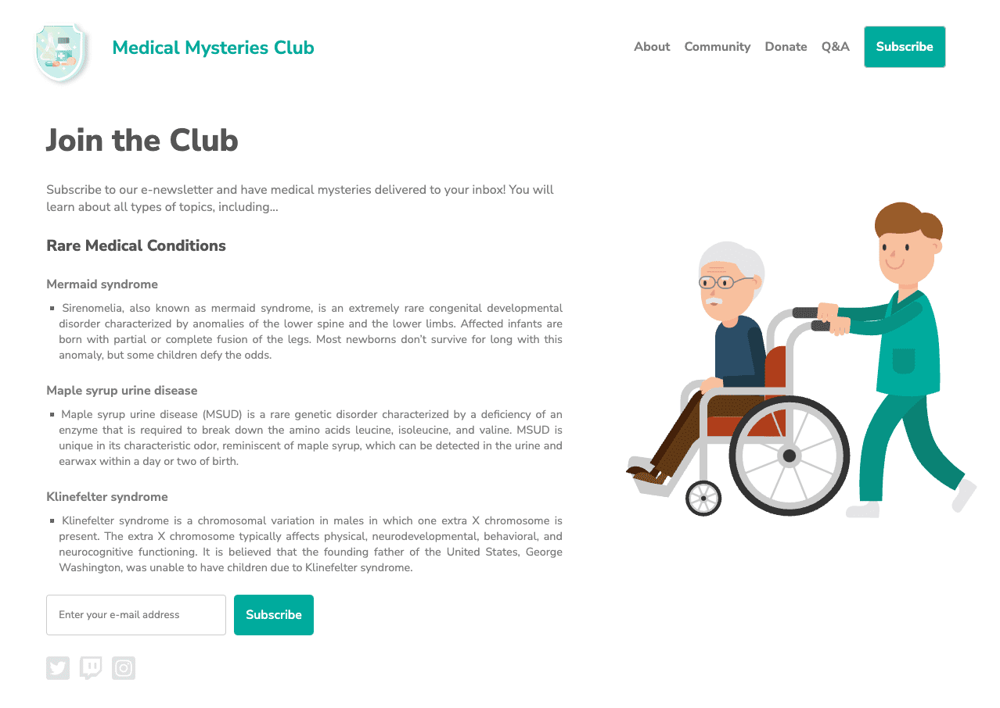
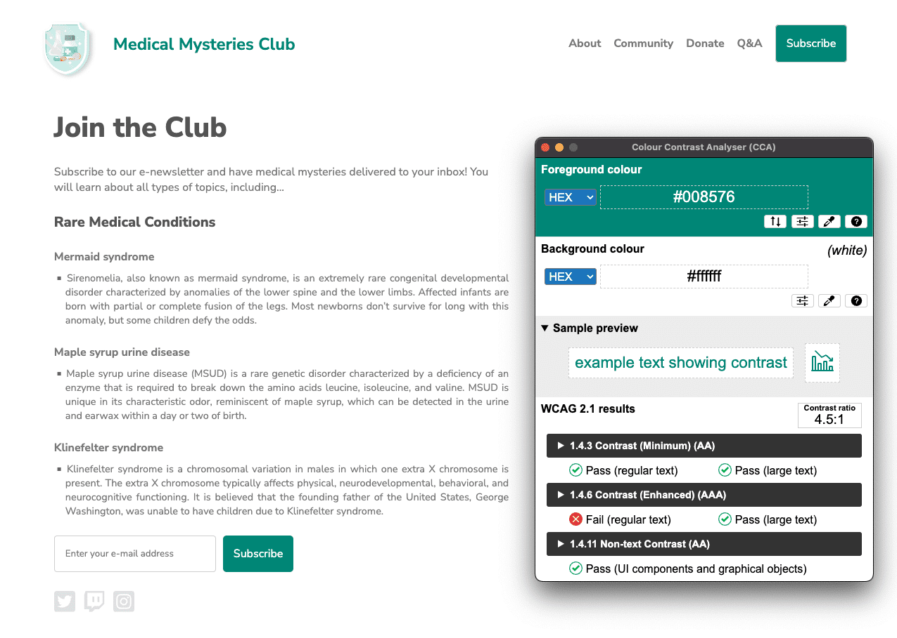

# 자동화된 접근성 테스트

지금까지 본 과정에서는 디지털 접근성의 개인, 비즈니스, 법적 측면과 디지털 접근성 준수의 기본 사항에 대해 배웠습니다. ARIA와 HTML의 적절한 사용 시점, 색상 대비 측정 방법, JavaScript가 필수적인 경우 등 포괄적인 디자인 및 코딩과 관련된 특정 주제들을 살펴보았습니다.

남은 모듈에서는 설계 및 구축에서 접근성 테스트로 방향을 전환합니다. 자동화, 수동, 보조 기술 테스트 도구와 기법을 포함하는 3단계 테스트 프로세스를 활용할 것입니다. 이러한 테스트 모듈 전반에 걸쳐 동일한 데모를 사용하여 웹 페이지를 접근 불가능한 상태에서 접근 가능한 상태로 개선해 나갈 것입니다.

자동화, 수동, 보조 기술 테스트 각각은 최고의 접근성을 갖춘 제품을 만드는 데 매우 중요합니다. 우리의 테스트는 WCAG(웹 콘텐츠 접근성 지침) 2.1의 [적합성 수준 A와 AA](https://www.w3.org/TR/WCAG22/#cc1)를 기준으로 합니다.

여러분의 산업 분야, 제품 유형, 지역 및 국가의 법률과 정책, 또는 전반적인 접근성 목표에 따라 따라야 할 지침과 달성해야 할 수준이 결정된다는 점을 기억하세요. 프로젝트에 특정 표준이 요구되지 않는 경우, 최신 버전의 WCAG를 따르는 것을 권장합니다. 접근성 감사, 적합성 유형/수준, [WCAG](https://web.dev/learn/accessibility/glossary#wcag) 및 [POUR](https://web.dev/learn/accessibility/glossary#pour)에 대한 일반적인 정보는 ["디지털 접근성은 어떻게 측정되나요?"](https://web.dev/learn/accessibility/measure)를 다시 참조하시기 바랍니다.

이제 아시다시피 접근성 준수는 장애인 지원에 관한 모든 것을 담고 있지는 않습니다. 하지만 테스트할 수 있는 기준을 제공하므로 좋은 시작점이 됩니다. 장애인을 대상으로 한 사용성 테스트 실시, 팀에 장애인 채용, 또는 더 포용적인 제품을 만드는 데 도움을 받기 위해 디지털 접근성 전문가나 기업에 자문을 구하는 등 접근성 적합성 테스트 외에도 추가적인 조치를 취할 것을 권장합니다.

<br>

## 자동화된 테스트 기본 사항

자동화된 접근성 테스트는 소프트웨어를 사용하여 디지털 제품이 사전 정의된 접근성 표준을 준수하는지 검사하는 방법입니다.

자동화된 접근성 테스트의 장점:

- 제품 수명주기의 각 단계에서 테스트를 쉽게 반복할 수 있음
- 간단한 단계로 실행 가능하며 결과를 빠르게 확인할 수 있음
- 테스트 실행이나 결과 해석에 깊은 접근성 지식이 필요하지 않음

자동화된 접근성 테스트의 단점:

- 자동화된 도구로는 제품의 모든 접근성 오류를 발견할 수 없음
- 거짓 양성(실제 WCAG 위반이 아닌 문제가 오류로 보고되는 현상) 발생
- 제품 유형과 역할에 따라 여러 도구가 필요할 수 있음

자동화된 테스트는 웹사이트나 앱의 접근성을 점검하는 좋은 첫 단계이지만, 모든 검사를 자동화할 수는 없습니다. 자동화할 수 없는 요소들의 접근성을 확인하는 방법은 [수동 접근성 테스트](https://web.dev/learn/accessibility/test-manual) 모듈에서 자세히 다루도록 하겠습니다.

<br>

## 자동화 도구의 유형

최초의 온라인 자동화 접근성 테스트 도구 중 하나는 1996년 응용 특수 기술 센터(CAST)에서 개발한 []"The Bobby Report"](https://jimthatcher.com/bobbyeval.htm)입니다. 현재는 [100개가 넘는 자동화 테스트 도구](https://www.w3.org/WAI/ER/tools/) 중에서 선택할 수 있습니다!

자동화 도구는 접근성 브라우저 확장 프로그램, 코드 린터, 데스크톱 및 모바일 애플리케이션, 온라인 대시보드, 심지어 자체 자동화 도구를 만들 수 있는 오픈 소스 API 등 다양한 형태로 구현됩니다.

자동화 도구 선택 시 고려해야 할 요소들은 다음과 같습니다:

- 테스트할 적합성 표준과 수준은 무엇인가? (WCAG 2.1, WCAG 2.0, [미국 섹션 508](https://www.section508.gov/), 또는 수정된 접근성 규칙 목록 등)
- 테스트 대상이 되는 디지털 제품의 유형은 무엇인가? (웹사이트, 웹 앱, 네이티브 모바일 앱, PDF, 키오스크 등)
- 소프트웨어 개발 수명주기의 어느 단계에서 제품을 테스트하는가?
- 도구 설정과 사용에 소요되는 시간은 얼마인가? (개인, 팀, 회사별로 다를 수 있음)
- 테스트 수행자는 누구인가? (디자이너, 개발자, QA 담당자 등)
- 접근성 검사 주기는 어떻게 되는가? 보고서에 포함될 세부 사항은 무엇인가? 문제점을 티켓팅 시스템과 직접 연동해야 하는가?
- 해당 환경과 팀에 가장 적합한 도구는 무엇인가?

이 외에도 고려해야 할 요소들이 많이 있습니다. 귀하와 팀에게 가장 적합한 도구를 선택하는 방법에 대한 자세한 내용은 WAI의 ["웹 접근성 평가 도구 선택"](https://www.w3.org/WAI/test-evaluate/tools/selecting/) 문서를 참고하시기 바랍니다.

<br>

## 데모: 자동화된 테스트

자동화된 접근성 테스트 데모에서는 Chrome의 [Lighthouse](https://developer.chrome.com/docs/lighthouse/overview)를 사용할 것입니다. Lighthouse는 성능, SEO, 접근성 등 다양한 영역을 검사하여 웹 페이지의 품질을 개선하기 위해 만들어진 오픈 소스 자동화 도구입니다.

이번 데모는 가상의 단체인 Medical Mysteries Club(의학 미스터리 클럽)을 위해 만든 웹사이트입니다. 이 사이트는 데모 목적으로 의도적으로 접근성이 떨어지게 제작되었습니다. 이러한 접근성 문제 중 일부는 눈으로 확인할 수 있으며, 일부(전부는 아님)는 자동화된 테스트를 통해 발견될 것입니다.

<br>

### 1단계

Chrome 브라우저에서 [Lighthouse 확장 프로그램](https://chrome.google.com/webstore/detail/lighthouse/blipmdconlkpinefehnmjammfjpmpbjk)을 설치하세요.

[Lighthouse를 테스트 워크플로에 통합하는 방법](https://github.com/GoogleChrome/lighthouse)은 다양하지만, 이번 데모에서는 Chrome 확장 프로그램을 사용하도록 하겠습니다.

<br>

### 2단계

우리는 [CodePen에서 데모](https://codepen.io/web-dot-dev/pen/yLqOaEP)를 만들었습니다. 다음 테스트를 진행하기 위해서는 [디버그 모드](https://cdpn.io/pen/debug/yLqOaEP)에서 보아야 합니다. 디버그 모드는 데모 웹 페이지를 둘러싼 `<iframe>`을 제거하는데, 이는 일부 테스트 도구와의 충돌을 방지하기 위해 중요합니다.

[CodePen의 디버그 모드](https://blog.codepen.io/documentation/debug-view/#getting-to-debug-view-3)에 대해 자세히 알아보기



<br>

### 3단계

[Chrome DevTools를 열고](https://developer.chrome.com/docs/devtools/open) Lighthouse 탭으로 이동하세요. "접근성"을 제외한 모든 카테고리 옵션의 선택을 해제합니다. 모드는 기본값으로 두고, 현재 테스트를 수행하는 기기 유형을 선택하세요.


_Lighthouse 보고서 DevTools 패널이 열려있는 Medical Mystery Club 웹사이트_

<br>

### 4단계

**페이지 로드 분석**을 클릭하고 Lighthouse가 테스트를 완료할 때까지 기다립니다.

테스트가 완료되면 Lighthouse는 테스트 대상 제품의 접근성 수준을 점수로 보여줍니다. [Lighthouse 점수](https://developer.chrome.com/docs/lighthouse/accessibility/scoring)는 발견된 문제의 개수, 유형, 그리고 이러한 문제들이 사용자에게 미치는 영향을 바탕으로 계산됩니다.

점수 외에도 Lighthouse 보고서는 발견된 문제점들에 대한 상세 정보와 이를 해결하는 방법을 알아볼 수 있는 참고 자료 링크를 제공합니다. 또한 보고서에는 통과되었거나 해당되지 않는 테스트 항목들과 수동으로 확인이 필요한 추가 항목 목록도 포함되어 있습니다.

> **Note:** 이 자동화된 Lighthouse 테스트는 2022년 12월에 실시되었습니다. 코드베이스, 브라우저, 보조 기술, 접근성 표준 또는 규칙 세트의 변경으로 인해 여러분의 테스트 결과는 다를 수 있습니다.


_Medical Mysteries Club 웹사이트는 2022년 12월 Lighthouse 테스트에서 62점을 받았습니다_

<br>

### 5단계

이제 자동화된 테스트에서 발견된 각각의 접근성 문제를 살펴보고 관련된 스타일과 마크업을 수정해보겠습니다.

**문제 1: ARIA 역할**
첫 번째 문제는 다음과 같습니다: "특정 [역할]을 가진 하위 요소를 필요로 하는 ARIA [역할]이 있는 요소에서 이러한 필수 하위 요소의 일부 또는 전체가 누락되어 있습니다. 일부 ARIA 부모 역할은 의도된 접근성 기능을 수행하기 위해 반드시 특정 하위 역할을 포함해야 합니다." [ARIA 역할 규칙에 대해 자세히 알아보기](https://dequeuniversity.com/rules/axe/4.4/aria-required-children)

우리 데모에서는 뉴스레터 구독 버튼이 실패 사례입니다.

```html
<button role="list" type="submit" tabindex="1">Subscribe</button>
```

🩹 Let's fix it.

입력란 옆의 "구독" 버튼에 잘못된 ARIA 역할이 적용되어 있습니다. 이 경우에는 해당 역할을 완전히 제거하면 됩니다.

```html
<button type="submit" tabindex="1">Subscribe</button>
```

**문제 2: ARIA hidden**

`"[aria-hidden="true"]` 속성이 있는 요소에 포커스 가능한 하위 요소들이 포함되어 있습니다. `[aria-hidden="true"]` 요소 내에 포커스 가능한 하위 요소가 있으면 화면 낭독기와 같은 보조 기술 사용자들이 이러한 상호작용 요소들에 접근할 수 없게 됩니다. [aria-hidden 규칙에 대해 자세히 알아보기](https://dequeuniversity.com/rules/axe/4.4/aria-hidden-focus)

```html
<input
  type="email"
  placeholder="Enter your e-mail address"
  aria-hidden="true"
  tabindex="-1"
  required
/>
```

🩹 Let's fix it.

입력란에 `aria-hidden="true"` 속성이 적용되어 있습니다. 이 속성은 해당 요소(및 그 안에 중첩된 모든 요소)를 보조 기술에서 감지할 수 없도록 숨깁니다.

```html
<input type="email" placeholder="Enter your e-mail address" tabindex="-1" required />
```

이 경우, 보조 기술 사용자들이 양식 필드에 접근하고 정보를 입력할 수 있도록 이 속성을 제거해야 합니다.

**문제 3: 버튼 이름**

버튼에 접근 가능한 이름이 없습니다. 버튼에 접근 가능한 이름이 없으면 화면 낭독기는 단순히 "버튼"이라고만 읽어주기 때문에, 화면 낭독기에 의존하는 사용자들은 이 버튼을 제대로 사용할 수 없게 됩니다.

[버튼 이름 규칙에 대해 자세히 알아보기](https://dequeuniversity.com/rules/axe/4.4/button-name)

```html
<button role="list" type="submit" tabindex="1">Subscribe</button>
```

🩹 Let's fix it.

[문제 1](https://web.dev/learn/accessibility/test-automated?continue=https%3A%2F%2Fweb.dev%2Flearn%2Faccessibility%23article-https%3A%2F%2Fweb.dev%2Flearn%2Faccessibility%2Ftest-automated#aria-roles)의 버튼 요소에서 부적절한 ARIA 역할을 제거하면 "구독"이라는 단어가 접근 가능한 버튼 이름이 됩니다. 이는 시맨틱 HTML 버튼 요소에 기본적으로 내장된 기능입니다. 더 복잡한 상황에서 사용할 수 있는 다른 패턴 옵션들도 있습니다.

```html
<button type="submit" tabindex="1">Subscribe</button>
```

**문제 4: 이미지 대체 텍스트 속성**

이미지 요소에 `[alt]` 속성이 누락되었습니다. 정보를 전달하는 요소에는 짧고 설명적인 대체 텍스트를 사용해야 합니다. 장식용 요소의 경우 빈 alt 속성을 사용하여 건너뛸 수 있습니다. [이미지 대체 텍스트 규칙에 대해 자세히 알아보기](https://dequeuniversity.com/rules/axe/4.4/image-alt)

```html
<a href="index.html">
  
</a>
```

🩹 Let's fix it.

로고 이미지는 링크 역할도 하므로, [이미지 모듈](https://web.dev/learn/accessibility/images)에서 배운 것처럼 이는 '실행 가능한 이미지'로 분류되어 이미지의 목적을 설명하는 대체 텍스트가 필요합니다. 일반적으로 페이지의 첫 번째 이미지는 로고인 경우가 많아서, 보조 기술 사용자들이 이미 이를 인지하고 있다고 가정할 수 있습니다. 따라서 이미지 설명에 이러한 맥락적 정보를 추가로 포함하지 않기로 결정할 수도 있습니다.

```html
<a href="index.html">
  
</a>
```

**문제 5: 링크 텍스트**

링크에 식별 가능한 이름이 없습니다. 식별 가능하고 고유하며 초점을 맞출 수 있는 링크 텍스트(또는 링크로 사용되는 이미지의 대체 텍스트)는 화면 낭독기 사용자의 탐색 경험을 향상시킵니다. [링크 텍스트 규칙에 대해 자세히 알아보기](https://dequeuniversity.com/rules/axe/4.4/link-name)

```html
<a href="#!"
  ><svg><path>...</path></svg></a
>
```

🩹 Let's fix it.

페이지의 모든 실행 가능한 이미지에는 해당 링크가 사용자를 어디로 이동시키는지에 대한 정보가 포함되어야 합니다. 이 문제를 해결하는 한 가지 방법은 예제의 로고 이미지처럼 이미지에 용도를 설명하는 대체 텍스트를 추가하는 것입니다. 이 방법은 `` 태그를 사용하는 이미지에는 잘 작동하지만 `<svg>` 태그에는 사용할 수 없습니다.

`<svg>` 태그를 사용하는 소셜 미디어 아이콘의 경우, SVG용 [다른 대체 설명 패턴](https://codepen.io/web-dot-dev/pen/poZyEZd)을 사용할 수 있습니다. 예를 들어 `<a>`와 `<svg>` 태그 사이에 정보를 추가하고 이를 시각적으로만 숨기거나, 지원되는 ARIA를 추가하는 등 여러 방법이 있습니다. 개발 환경과 코드 제약 사항에 따라 더 적합한 방법을 선택할 수 있습니다.

가장 많은 보조 기술을 지원하는 가장 간단한 방법은 `<svg>` 태그에 `role="img"`를 추가하고 `<title>` 요소를 포함하는 것입니다.

```html
<a href="#!">
  <svg role="img">
    <title>Connect on our Twitter page.</title>
    <path>...</path>
  </svg>
</a>
```

**문제 6: 색상 대비**

배경색과 전경색 간의 대비율이 충분하지 않습니다. 대비가 낮은 텍스트는 많은 사용자들이 읽기 어렵거나 아예 읽을 수 없습니다. [색상 대비 규칙에 대해 자세히 알아보기](https://dequeuniversity.com/rules/axe/4.4/color-contrast)

다음 두 가지 사례가 발견되었습니다:


_Medical Mysteries Club의 글자색은 `#01aa9d`이고 배경색은 `#ffffff`입니다. 색상 대비율은 2.9:1입니다._


_Mermaid syndrome의 글자색은 `#7c7c7c`이고 배경색은 `#ffffff`입니다. 색상 대비율은 4.2:1입니다._

🩹 Let's fix it.

웹페이지에서 다수의 색상 대비 문제가 발견되었습니다. [색상 및 대비](https://web.dev/learn/accessibility/color-contrast) 모듈에서 배운 것처럼, 일반 크기 텍스트(18pt/24px 미만)는 4.5:1의 색상 대비가 필요한 반면, 큰 텍스트(18pt/24px 이상 또는 14pt/18.5px 굵은체)와 필수 아이콘은 3:1의 대비율만 충족하면 됩니다.

페이지 제목의 청록색 텍스트는 24px의 큰 텍스트이므로 3:1의 색상 대비율만 충족하면 됩니다. 하지만 청록색 버튼은 16px 굵은체의 일반 크기 텍스트로 간주되어 4.5:1의 색상 대비율을 충족해야 합니다.

이 문제는 다음 두 가지 방법으로 해결할 수 있습니다:

- 4.5:1의 대비율을 충족하는 더 어두운 청록색을 사용하거나
- 버튼 텍스트 크기를 18.5px 굵은체로 키우고 청록색 색상 값을 약간 조정하는 방법

두 방법 모두 디자인의 심미성을 해치지 않습니다.

또한 흰색 배경 위의 회색 텍스트도 페이지의 가장 큰 두 제목을 제외하고는 모두 색상 대비 기준을 충족하지 못합니다. 이 텍스트들은 4.5:1의 색상 대비 요구사항을 충족하기 위해 더 어둡게 조정해야 합니다.



_클럽 이름인 'Medical Mysteries Club'의 색상값을 `#008576`으로 변경했고, 배경색은 `#ffffff`를 유지했습니다. 이렇게 수정된 색상 대비율은 4.5:1입니다. 이미지를 클릭하면 전체 크기로 볼 수 있습니다._


_Mermaid syndrome 텍스트의 색상값을 `#767676`으로 변경했고, 배경색은 `#ffffff`를 그대로 유지했습니다. 색상 대비율은 4.5:1입니다._

**문제7: 목록 구조**

목록 항목(`<li>`)이 `<ul>` 또는 `<ol>` 부모 요소 안에 포함되어 있지 않습니다. 화면 낭독기가 목록 항목(`<li>`)을 올바르게 읽어주려면 이들이 반드시 부모 요소인 `<ul>` 또는 `<ol>` 안에 포함되어 있어야 합니다.

[목록 규칙에 대해 자세히 알아보기](https://dequeuniversity.com/rules/axe/4.4/listitem)

```html
<div class="ul">
  <li><a href="#">About</a></li>
  <li><a href="#">Community</a></li>
  <li><a href="#">Donate</a></li>
  <li><a href="#">Q&A</a></li>
  <li><a href="#">Subscribe</a></li>
</div>
```

🩹 Let's fix it.

이 데모에서는 `<ul>` 태그를 사용하는 대신 CSS 클래스를 사용하여 순서 없는 목록을 구현했습니다. 이렇게 부적절하게 코드를 작성하면서 이 태그에 원래 내장된 시맨틱 HTML 기능을 잃어버리게 되었습니다. 이 접근성 문제를 해결하기 위해서는 CSS 클래스를 실제 `<ul>` 태그로 교체하고 관련 CSS를 수정해야 합니다.

```html
<ul>
  <li><a href="#">About</a></li>
  <li><a href="#">Community</a></li>
  <li><a href="#">Donate</a></li>
  <li><a href="#">Q&A</a></li>
  <li><a href="#">Subscribe</a></li>
</ul>
```

**문제8: tabindex**

일부 요소들의 `tabindex` 값이 0보다 큽니다. 0보다 큰 값은 명시적인 탐색 순서를 지정하는 것을 의미합니다. 이는 기술적으로는 유효하지만, 보조 기술을 사용하는 사용자들에게 종종 불편한 경험을 주게 됩니다. [tabindex 규칙에 대해 자세히 알아보기](https://dequeuniversity.com/rules/axe/4.4/tabindex)

```html
<button type="submit" tabindex="1">Subscribe</button>
```

🩹 Let's fix it.

웹 페이지의 자연스러운 탭 순서를 변경해야 할 특별한 이유가 없다면, tabindex 속성에 양수를 설정할 필요가 없습니다. 자연스러운 탭 순서를 유지하기 위해서는 tabindex를 `0`으로 설정하거나 이 속성을 완전히 제거하면 됩니다.

```html
<button type="submit">Subscribe</button>
```

<br>

### 6단계

이제 자동화된 접근성 문제들을 모두 해결했으니, 새로운 디버그 모드 페이지를 열고 Lighthouse 접근성 검사를 다시 실행해보세요. 이번에는 첫 번째 실행보다 점수가 훨씬 더 좋아야 합니다.


_Lighthouse 점수가 100점이 되었습니다. 이는 모든 Lighthouse 관련 문제들이 해결되었다는 의미입니다._

이러한 자동화된 접근성 개선사항들을 모두 새로운 CodePen에 적용했습니다.

<br>

## 다음 단계

잘 하셨습니다! 많은 것을 이루어냈지만, 아직 끝나지 않았습니다. 이제 수동 접근성 테스트 모듈에서 설명하는 수동 검사 단계로 넘어가보겠습니다.
