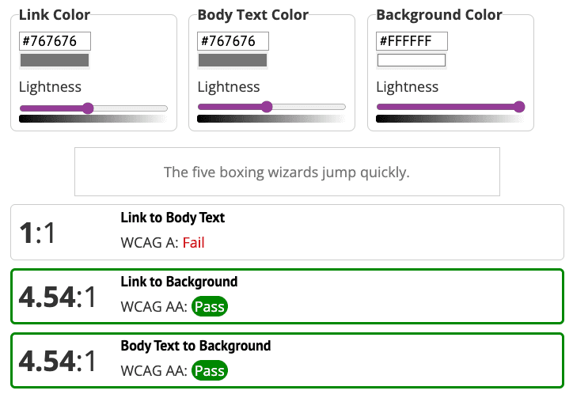
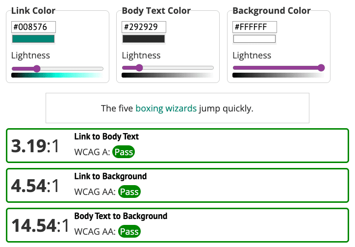
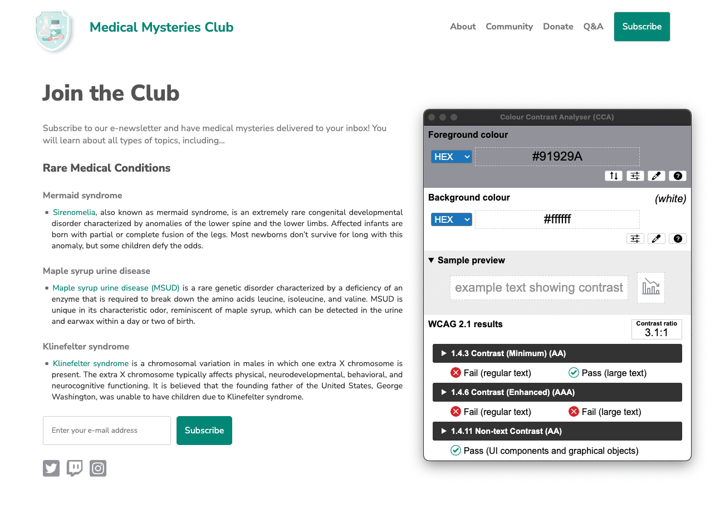
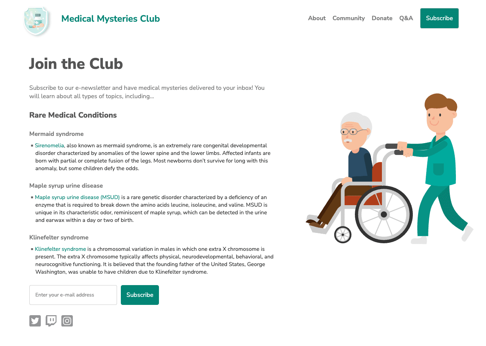

# 수동 접근성 테스트

> **Note**: 수동 접근성 테스트에 대한 이 모듈은 이전 모듈인 자동화된 접근성 테스트의 연속입니다. 아직 해당 모듈의 연습 문제를 완료하지 않았다면 먼저 완료하시기를 권장합니다. 이 모듈은 이전 모듈이 끝난 지점부터 시작하여 수동 접근성 테스트 도구와 기술에 초점을 맞춥니다.

</br>

## 수동 테스트 기본사항

수동 접근성 테스트는 키보드, 시각적, 인지적 테스트, 도구 및 기술을 사용하여 자동화된 도구로는 찾을 수 없는 문제를 찾습니다. 자동화된 도구가 WCAG에서 식별된 모든 성공 기준을 다루지는 않기 때문에, 자동화된 접근성 테스트만 실행하고 테스트를 중단하면 안 됩니다!

기술이 발전함에 따라 [더 많은 테스트가 자동화된 도구만으로도 가능](https://a11y-automation.dev/violations)할 수 있지만, 현재로서는 모든 해당 WCAG 체크포인트를 다루기 위해서는 수동 및 보조 기술 검사를 테스트 프로토콜에 추가해야 합니다.

> **Note**: 각 자동화된 테스트 도구는 서로 다른 접근성 규칙 세트를 가지고 있으며 이를 다른 방식으로 사용할 수 있습니다. 실제 WCAG 체크포인트 적용 범위는 도구와 테스트되는 콘텐츠에 따라 다릅니다.

수동 접근성 테스트의 장점:

- 비교적 간단하고 빠르게 실행 가능
- 자동화된 테스트만으로는 잡아낼 수 없는 더 많은 문제를 발견
- 성공적인 테스트를 위해 필요한 도구와 전문 지식이 적음

수동 접근성 테스트의 단점:

- 자동화된 테스트보다 더 복잡하고 시간이 많이 소요됨
- 대규모로 반복하기 어려울 수 있음
- 테스트를 실행하고 결과를 해석하는 데 더 많은 접근성 전문 지식이 필요

자동화된 도구로 현재 감지할 수 있는 접근성 요소와 세부 사항을 감지할 수 없는 것과 비교해 보겠습니다.

| 자동화 가능                      | 자동화 불가능                                                                                                                                  |
| -------------------------------- | ---------------------------------------------------------------------------------------------------------------------------------------------- |
| 단색 배경의 텍스트 색상 대비     | 그라데이션/이미지 위 텍스트의 [색상 대비](https://web.dev/learn/accessibility/color-contrast)                                                  |
| 이미지 대체 텍스트 존재 여부     | [이미지 대체 텍스트의 정확성과 적절한 할당 여부](https://web.dev/learn/accessibility/images)                                                   |
| 제목, 목록, 랜드마크의 존재 여부 | [제목, 목록, 랜드마크](https://web.dev/learn/accessibility/structure)가 올바르게 마크업되었는지와 모든 요소가 고려되었는지 여부                |
| ARIA의 존재 여부                 | [ARIA](https://web.dev/learn/accessibility/aria-html)가 적절하게 사용되고 올바른 요소에 적용되었는지 여부                                      |
| 키보드 포커스 가능 요소 식별     | 어떤 요소에 [키보드 포커스](https://web.dev/learn/accessibility/focus)가 누락되었는지, 포커스 순서가 논리적인지, 포커스 표시기가 보이는지 여부 |
| iFrame 제목 감지                 | [iFrame](https://web.dev/learn/accessibility/more-html)의 포커스 순서가 논리적이고 포커스 표시기가 보이는지 여부                               |
| 비디오 요소의 존재 여부          | 비디오 요소에 적절한 [대체 미디어](https://web.dev/learn/accessibility/motion)(자막 및 대본 등)가 있는지 여부                                  |

</br>

## 수동 테스트의 유형

웹 페이지나 앱의 디지털 접근성을 검토할 때는 다양한 수동 도구와 기술을 고려해야 합니다. 수동 테스트에서 가장 중점을 두는 세 가지 영역은 키보드 기능성, 시각적 검토, 그리고 일반 콘텐츠 검사입니다.

이 모듈에서는 각각의 주제를 개괄적으로 다룰 것입니다. 하지만 여기서 다루는 테스트들이 여러분이 실행할 수 있거나 실행해야 하는 모든 수동 테스트를 망라하는 것은 아닙니다. 신뢰할 수 있는 출처의 [수동 접근성 체크리스트](https://www.ibm.com/able/toolkit/verify/manual/)로 시작하여, 여러분의 특정 디지털 제품과 팀의 요구사항에 맞는 자체적인 수동 테스트 체크리스트를 개발하시기를 권장합니다.

> **Note**: 일부 조직에서는 보조 기술(AT) 검사가 수동 테스트 프로세스의 일부라고 간주합니다. 이는 두 영역 간에 많은 중복이 있기 때문입니다. 하지만 이 과정에서는 AT 테스트를 별도의 모듈로 분리했습니다. AT 테스트가 다른 수동 테스트보다 더 고급 수준이며, 더 깊고 독립적인 초점을 맞출 필요가 있기 때문입니다.

</br>

### 키보드 검사

모든 디지털 접근성 문제의 약 25%가 키보드 지원 부족과 관련이 있는 것으로 추정됩니다. [키보드 포커스](https://web.dev/learn/accessibility/focus) 모듈에서 배웠듯이, 이는 시각이 있는 키보드 전용 사용자, 저시력/시각장애인 스크린 리더 사용자, 그리고 키보드 접근성에 의존하는 기술을 사용하는 음성 인식 소프트웨어 사용자 등 모든 유형의 사용자에게 영향을 미칩니다.

키보드 테스트는 다음과 같은 질문에 답합니다:

- 웹 페이지나 기능이 작동하기 위해 마우스가 필요한가?
- 탭 이동 순서가 논리적이고 직관적인가?
- 키보드 포커스 표시기가 항상 보이는가?
- 포커스를 가둬서는 안 되는 요소에 포커스가 갇히지는 않는가?
- 포커스를 가둬야 하는 요소를 우회하거나 그 주변을 탐색할 수 있는가?
- 포커스를 받은 요소를 닫을 때 포커스 표시기가 논리적인 위치로 돌아가는가?

키보드 기능성의 영향은 매우 크지만, 테스트 절차는 매우 간단합니다. 마우스를 치우거나 작은 JavaScript 패키지를 설치하고 키보드만을 사용하여 웹사이트를 테스트하면 됩니다. 다음은 키보드 테스트에 필수적인 명령어들입니다.

| 키                 | 결과                              |
| ------------------ | --------------------------------- |
| Tab                | 한 활성 요소에서 다음 요소로 이동 |
| Shift + Tab        | 한 활성 요소에서 이전 요소로 이동 |
| 화살표 키          | 관련 컨트롤 간 순환               |
| 스페이스바         | 상태 전환 및 페이지 아래로 이동   |
| Shift + 스페이스바 | 페이지 위로 이동                  |
| Enter              | 특정 컨트롤 실행                  |
| Escape             | 동적으로 표시된 객체 닫기         |

</br>

### 시각적 검사

시각적 검사는 페이지의 시각적 요소에 초점을 맞추며, 화면 확대나 브라우저 줌 같은 도구를 활용하여 웹사이트나 앱의 접근성을 검토합니다.

시각적 검사를 통해 알 수 있는 사항:

- 그라디언트나 이미지 위의 텍스트와 같이 자동화된 도구가 감지할 수 없는 색상 대비 문제가 있는가?
- 제목, 목록 및 기타 구조적 요소처럼 보이지만 실제로는 그렇게 코딩되지 않은 요소가 있는가?
- 내비게이션 링크와 양식 입력이 웹사이트나 앱 전체에서 일관성이 있는가?
- 권장사항을 초과하는 깜박임, 스트로보, 또는 애니메이션이 있는가?
- 문자, 단어, 줄, 단락 간의 적절한 간격이 있는가?
- 화면 확대기나 브라우저 줌을 사용했을 때 모든 콘텐츠가 보이는가?

> **Note**: 때로는 추가적인 도움 없이는 시각적 요소의 접근성을 관찰할 수 없습니다. 이에 대해서는 [보조 기술 테스트](https://web.dev/learn/accessibility/test-assistive-technology)에 관한 다음 모듈에서 자세히 다룰 것입니다.

</br>

### 콘텐츠 검사

레이아웃, 움직임, 색상에 초점을 맞추는 시각적 테스트와 달리, 콘텐츠 검사는 페이지의 단어에 초점을 맞춥니다. 복사된 내용 자체뿐만 아니라 맥락을 검토하여 다른 사람들에게도 이해가 되는지 확인해야 합니다.

콘텐츠 검사가 답하는 질문들:

- 페이지 제목, 제목, 양식 레이블이 명확하고 설명적인가?
- 이미지 대체 텍스트가 간결하고, 정확하며, 유용한가?
- 의미나 정보를 전달하는 유일한 방법으로 색상만 사용되고 있는가?
- 링크가 설명적인가, 아니면 "더 읽기" 또는 "여기를 클릭"과 같은 일반적인 텍스트를 사용하는가?
- 페이지 내에 언어 변경이 있는가?
- [평이한 언어](https://www.w3.org/WAI/GL/WCAG3/2021/how-tos/clear-words/)가 사용되었으며, 모든 약어가 처음 언급될 때 풀어서 설명되었는가?

일부 콘텐츠 검사는 부분적으로 자동화될 수 있습니다. 예를 들어, "여기를 클릭"이라는 문구를 확인하고 변경을 제안하는 JavaScript 린터를 작성할 수 있습니다. 그러나 이러한 맞춤형 솔루션들은 여전히 맥락에 맞는 내용으로 변경하기 위해 사람의 개입이 필요한 경우가 많습니다.

</br>

## 데모: 수동 테스트

지금까지 우리는 데모 웹 페이지에서 자동화된 테스트를 실행하여 8가지 다른 유형의 문제를 찾아 수정했습니다. 이제 수동 검사를 실행하여 더 많은 접근성 문제를 발견할 수 있는지 확인해보겠습니다.

</br>

### 1단계

우리의 업데이트된 [CodePen 데모](https://codepen.io/web-dot-dev/pen/NWBaMzb)에는 모든 자동화된 접근성 업데이트가 적용되어 있습니다.

다음 테스트를 진행하기 위해 [디버그 모드](https://cdpn.io/pen/debug/NWBaMzb)에서 보십시오. 이는 중요한데, 일부 테스트 도구와 간섭할 수 있는 데모 웹 페이지를 둘러싼 `<iframe>`을 제거하기 때문입니다. [CodePen의 디버그 모드](https://blog.codepen.io/documentation/debug-view/#getting-to-debug-view-3)에 대해 자세히 알아보세요.

</br>

### 2단계

마우스나 트랙패드를 치우고 키보드만을 사용하여 DOM을 위아래로 탐색하면서 수동 테스트 프로세스를 시작하세요.

#### 문제 1: 보이는 포커스 표시기

첫 번째 키보드 문제는 바로 눈에 띌 것입니다—또는 오히려, 보이지 않아야 합니다—보이는 포커스 표시기가 제거되었기 때문입니다. 데모의 CSS를 살펴보면, 코드베이스에 악명 높은 "outline: none"이 추가된 것을 발견할 수 있을 것입니다.

```css
:focus {
  outline: none;
}
```

#### 수정해 봅시다

[키보드 포커스 모듈](https://web.dev/learn/accessibility/focus#focus_indicator)에서 배웠듯이, 웹 브라우저가 사용자를 위한 가시적인 포커스를 추가할 수 있도록 이 코드 라인을 제거해야 합니다. 더 나아가 디지털 제품의 미적 요구사항을 충족하는 포커스 표시기를 스타일링할 수 있습니다.

```css
:focus {
  outline: 3px dotted #008576;
}
```

#### 문제 2: 포커스 순서

포커스 표시기를 수정하고 보이게 만든 후에는 페이지를 탭으로 이동하며 확인하세요. 그렇게 하면 뉴스레터 구독에 사용되는 양식 입력 필드가 포커스를 받지 않는다는 것을 알 수 있습니다. 음수 tabindex로 인해 자연스러운 포커스 순서에서 제외되었습니다.

```html
<input
  type="email"
  placeholder="Enter your e-mail address"
  aria-hidden="true"
  tabindex="-1"
  required
/>
```

#### 수정해 봅시다

사람들이 뉴스레터 신청을 위해 이 필드를 사용하기를 원하므로, 음수 tabindex를 제거하거나 0으로 설정하여 입력란이 다시 키보드로 포커스 가능하도록 만들면 됩니다.

```html
<input
  type="email"
  placeholder="Enter your e-mail address"
  aria-hidden="true"
  required
/>
```

</br>

### 3단계

키보드 포커스 확인이 끝나면 시각적 검사와 콘텐츠 검사로 넘어갑니다.

#### 문제 3: 링크 색상 대비

데모 페이지를 위아래로 탭 이동하며 키보드 테스트를 하는 동안, 아마도 다양한 의료 상태에 대한 단락에서 시각적으로 숨겨진 세 개의 링크에 키보드가 포커스된 것을 발견했을 것입니다.

페이지가 접근성을 갖추려면 링크는 주변 텍스트와 구별되어야 하며, 마우스 호버와 키보드 포커스 시 색상이 아닌 스타일 변화를 포함해야 합니다.

#### 수정해 봅시다

빠른 해결책은 단락 내 링크에 밑줄을 추가하여 눈에 띄게 만드는 것입니다. 이는 접근성 문제를 해결하겠지만, 원하는 전반적인 디자인 미학에 맞지 않을 수 있습니다.

밑줄을 추가하지 않기로 선택한다면, 배경과 본문 모두에 대한 요구사항을 충족하도록 색상을 수정해야 합니다.

[링크 대비 검사 도구](https://webaim.org/resources/linkcontrastchecker/)를 사용하여 데모를 살펴보면, 링크 색상이 일반 크기 텍스트와 배경 사이의 4.5:1 색상 대비 요구사항을 충족하는 것을 볼 수 있습니다. 하지만 밑줄이 없는 링크는 주변 텍스트에 대해 3:1 색상 대비 요구사항도 충족해야 합니다.

한 가지 방법은 링크 색상을 페이지의 다른 요소와 일치하도록 변경하는 것입니다. 하지만 링크 색상을 초록색으로 변경한다면, 링크, 배경, 주변 텍스트라는 세 요소 사이의 전반적인 색상 대비 요구사항을 충족하도록 본문 색상도 수정해야 합니다.

|                          |
| ------------------------------------------------------- |
| _링크와 본문 텍스트가 동일할 때는 테스트에 실패합니다._ |

|                        |
| ----------------------------------------------------- |
| _링크와 본문 텍스트가 다를 때는 테스트를 통과합니다._ |

#### 문제 4: 아이콘 색상 대비

또 다른 놓친 색상 대비 문제는 소셜 미디어 아이콘입니다. [색상과 대비](https://web.dev/learn/accessibility/color-contrast#calculate_color_contrast) 모듈에서 배웠듯이, 필수적인 아이콘은 배경과 3:1의 색상 대비를 충족해야 합니다. 하지만 데모에서 소셜 미디어 아이콘은 1.3:1의 대비율을 가지고 있습니다.

#### 수정해 봅시다

3:1 색상 대비 요구사항을 충족하기 위해 소셜 미디어 아이콘을 더 어두운 회색으로 변경합니다.



> **Note**: 텍스트 입력창 주변의 테두리가 배경과의 3:1 색상 대비 요구사항을 충족하지 않는 것을 발견할 수 있습니다. 하지만 이 입력창은 [비텍스트 대비](https://www.w3.org/WAI/WCAG21/Understanding/non-text-contrast.html) 개요 페이지에 따르면, 해당 크기에 대한 필요한 색상 대비 요구사항을 충족하는 플레이스홀더 텍스트를 가지고 있습니다.

#### 문제 5: 콘텐츠 레이아웃

단락 콘텐츠의 레이아웃을 보면, 텍스트가 완전 양쪽 정렬되어 있습니다. [타이포그래피 모듈](https://web.dev/learn/accessibility/typography#structure_and_layout)에서 배웠듯이, 이는 일부 사용자가 텍스트를 읽기 어렵게 만들 수 있는 "공백의 강"을 만듭니다.

```css
p.bullet {
  text-align: justify;
}
```

#### 수정해 봅시다

데모의 텍스트 정렬을 재설정하기 위해, 코드를 `text-align: left;`로 업데이트하거나 CSS에서 해당 줄을 완전히 제거할 수 있습니다. 왼쪽 정렬이 브라우저의 기본값이기 때문입니다. 다른 상속된 스타일이 기본 텍스트 정렬을 제거할 수 있으므로, 코드를 반드시 테스트해야 합니다.

```css
p.bullet {
  text-align: left;
}
```

</br>

### 4단계

|                                          |
| ----------------------------------------------------------------------- |
| 이미지에서 보여지는 것처럼 데모의 모든 수동 문제가 이제 해결되었습니다. |

이전 단계에서 설명한 모든 수동 접근성 문제를 식별하고 수정했다면, 여러분의 페이지는 우리의 스크린샷과 비슷하게 보일 것입니다.

이 모듈에서 다룬 것보다 더 많은 접근성 문제를 수동 검사에서 발견할 수 있습니다. 이러한 많은 문제들은 다음 모듈에서 다루게 될 것입니다.

</br>

## 다음 단계

잘 하셨습니다! 자동화 및 수동 테스트 모듈을 완료하셨습니다. 모든 자동화 및 수동 접근성 수정사항이 적용된 [업데이트된 CodePen](https://codepen.io/web-dot-dev/pen/eYjZdve)을 확인할 수 있습니다.

이제 [보조 기술 테스트](https://web.dev/learn/accessibility/test-assistive-technology)에 초점을 맞춘 마지막 테스트 모듈로 이동하세요.
