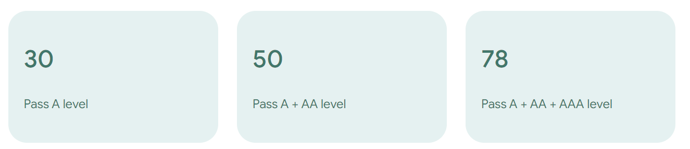
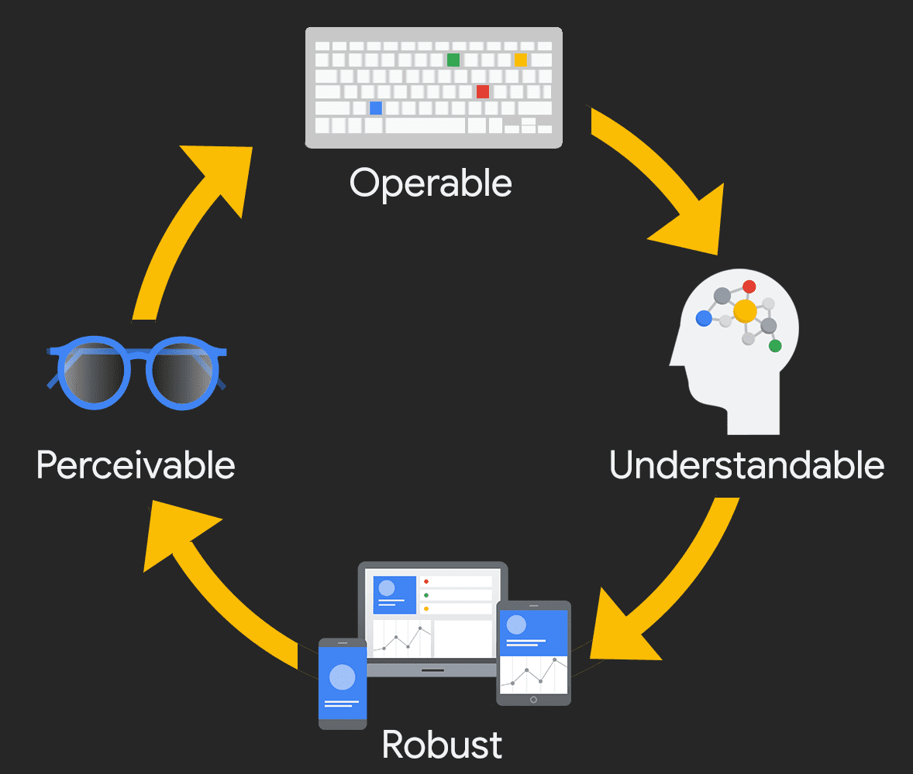
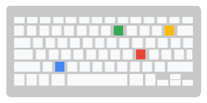
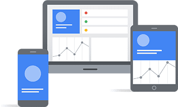

# 디지털 접근성은 어떻게 측정되나요?

> 이 페이지에서는  
> 접근성 테스트 소개  
> 웹 콘텐츠 접근성 지침 (WCAG)  
> 접근성 원칙

  

[디지털 접근성](https://www.w3.org/WAI/fundamentals/accessibility-intro/)이란 개인의 정신적 또는 신체적 능력에 상관없이 누구나 웹사이트, 앱, 또는 기타 디지털 제품을 의미 있고 동등하게 이용할 수 있도록 설계하고 개발하는 것을 말합니다.

그렇다면 디지털 제품의 접근성은 어떻게 측정할 수 있을까요? 어떤 기준으로 접근성이 확보되었다고 판단할 수 있을까요?

 

## 접근성 테스트 소개

디지털 제품의 접근성을 테스트하는 방법은 다양합니다. 가장 기본적인 접근 방식 중 하나는 접근성 표준을 기준으로 제품을 평가하는 것입니다.

접근성 표준에는 여러 유형이 있습니다. 일반적으로 해당 산업, 제품 유형, 현지 또는 국가의 [법률](https://www.3playmedia.com/blog/major-accessibility-laws/) 과 [정책](https://www.w3.org/WAI/policies/) 또는 전반적인 접근성 목표에 따라 따라야 할 지침과 충족해야 할 수준이 결정됩니다. 프로젝트에 특정 표준이 요구되지 않는 경우, [웹 콘텐츠 접근성 지침(WCAG)](https://web.dev/learn/accessibility/measure#wcag)의 최신 버전을 따르는 것이 일반적으로 권장됩니다.

접근성 표준과 적합성 수준에 따라 디지털 제품을 테스트하는 과정을 보통 [접근성 심사](https://www.w3.org/WAI/test-evaluate/)라고 합니다. 접근성 심사는 디자인, 자동화, 수동 테스트, 그리고 보조 기술(AT) 테스트 등 다양한 방법론과 기술, 도구를 활용합니다.

접근성 심사를 통해 디지털 제품의 기본적인 접근성 준수 수준을 파악할 수 있습니다. 하지만 프로젝트 시작 시 한 번만 심사를 실시하는 것으로는 제품의 접근성을 완전히 판단하기 어렵습니다. 소프트웨어 제품 수명주기 전반에 걸쳐 여러 차례 심사를 실시하여, 미리 정해둔 접근성 체크포인트나 지침에 따라 적합성 수준의 변화를 지속적으로 확인해야 합니다.

  

## 웹 콘텐츠 접근성 지침 (WCAG)

웹 콘텐츠 접근성 지침(WCAG)은 W3C가 개인 및 여러 기관과 협력하여 개발한 국제적인 접근성 표준입니다. WCAG의 목표는 전 세계의 개인, 조직 및 정부의 요구사항을 충족하는 통일된 디지털 접근성 표준을 제공하는 것입니다.

WCAG는 주로 웹 기반 및 네이티브 모바일 앱 디자이너와 개발자를 대상으로 합니다. 하지만 소프트웨어 개발자, 콘텐츠 제작자/편집자, 그리고 모든 직급의 관리자들도 WCAG 기반 기술을 이해하고 적용함으로써 많은 이점을 얻을 수 있습니다. 또한 [저작 도구 접근성 지침(ATAG)](https://www.w3.org/WAI/standards-guidelines/atag/)과 [사용자 에이전트 접근성 지침(UAAG)](https://www.w3.org/WAI/standards-guidelines/uaag/)등 다른 W3C 표준들도 여러분의 업무에 적용될 수 있으므로, [W3C 표준 목록](https://www.w3.org/standards/)을 검토하여 자신의 역할과 프로젝트에 가장 적합한 표준을 선택해 사용하시기 바랍니다.

접근성 측면에서 WCAG는 적합성 테스트의 "황금 기준"으로 여겨집니다. [WCAG의 첫 초안](https://www.w3.org/TR/WAI-WEBCONTENT/)은 1999년에 발표되었습니다. 현재 사용 중인 버전은 2018년 6월에 발표된 [WCAG 2.1](https://www.w3.org/TR/WCAG21/)이며, [WCAG 2.2](https://www.w3.org/TR/WCAG22/)는 2023년 발표 예정입니다. 가이드라인을 전면 개편한 [WCAG 3.0](https://www.w3.org/WAI/standards-guidelines/wcag/wcag3-intro/)이 향후 발표를 위해 초안 작성 중이지만, 완전한 W3C 표준이 되기까지는 앞으로 몇 년이 더 걸릴 것으로 예상됩니다.

WCAG 지침은 A, AA, AAA 세 단계의 성공 기준을 가지고 있습니다. 이 성공 기준에 따라 WCAG 준수 여부가 결정됩니다. WCAG를 준수하기 위해서는 테스트 중인 디지털 제품이 목표로 하는 단계의 성공 기준을 충족해야 합니다.

현재 표준(WCAG 2.1)에는 총 78개의 성공 기준이 있으며, 이는 각 수준에 걸쳐 분포되어 있습니다. 여기서 주목해야 할 점은 각 수준이 단계적으로 구성되어 있다는 것입니다. 예를 들어, 여러분의 접근성 목표가 AA 수준이라면 이 적합성 수준을 달성하기 위해서는 A 수준과 AA 수준의 성공 기준을 모두 충족해야 합니다.

 

## 접근성 원칙

WCAG 성공 기준은 디자이너와 개발자들이 접근성 높은 웹사이트와 앱을 만들 수 있도록 안내하는 매우 중요한 상세 지침입니다. 접근성 준수 테스트에서 발생하는 문제들을 해결하기 위해서는 이 지침들을 이해하는 것이 필수적이지만, 지침의 내용은 곧 매우 기술적인 수준으로 들어갑니다.

이 분야에 처음 입문하시는 분이라면, WCAG의 기본 원칙인 [POUR(인식가능성, 운용가능성, 이해가능성, 견고성)](https://www.w3.org/WAI/fundamentals/accessibility-principles/)부터 시작하는 것이 좋습니다. POUR 원칙을 디지털 제품에 적용하면, 장애인을 포함한 실제 사용자들이 여러분의 제품을 어떻게 이용하는지에 초점을 맞출 수 있습니다.

 

### 인식가능성

POUR의 첫 번째 카테고리는 인식가능성입니다. 이 원칙은 사용자가 화면의 모든 필수 정보를 인식할 수 있어야 하며, 이 정보가 다양한 감각을 통해 전달되어야 함을 의미합니다.

**스스로에게 이렇게 물어보세요:** 특정 장애가 있는 사람이 인식하기 어려운 디지털 제품의 콘텐츠나 기능이 있나요? 시각, 운동, 청각, 인지 및 언어 장애, 전정기 장애 및 발작 장애 등 다양한 유형의 장애를 모두 고려해야 합니다.

**인식가능성의 예:**

- 순수하게 장식 목적이 아닌 모든 이미지와 필수 아이콘에 대체 텍스트를 추가합니다.
- 동영상에 자막, 대본, 음성 설명을 추가합니다.
- 색상만으로 정보나 의미를 전달하지 않도록 합니다.

 

### 운용가능성

두 번째 카테고리는 운용가능성(Operable)입니다. 이 원칙에 따르면, 사용자가 디지털 제품의 인터페이스를 조작할 수 있어야 합니다. 인터페이스는 사용자가 수행할 수 없는 상호작용을 요구해서는 안 됩니다.

**스스로에게 이렇게 물어보세요:** 사용자가 디지털 제품의 상호작용 요소를 제어할 수 있나요? 포커스 순서에 문제가 있거나 키보드로 빠져나올 수 없는 부분이 있나요? 터치 인터페이스는 어떻게 다루고 있나요?

**운용가능성의 예:**

- 모든 활성 요소에 키보드 및 터치스크린 지원을 추가합니다.
- 슬라이드쇼와 동영상에 필요한 모든 제어 기능이 사용 가능한지 확인합니다.
- 사용자에게 양식을 작성할 충분한 시간을 제공하거나, 시간을 연장할 수 있는 방법을 제공합니다.

 

### 이해가능성

POUR의 세 번째 카테고리는 이해가능성(Understandable)입니다. 이 원칙에 따르면 사용자가 사용자 인터페이스의 정보와 작동 방식을 이해할 수 있어야 합니다.

**스스로에게 이렇게 물어보세요:** 모든 내용이 명확하게 작성되어 있나요? 모든 상호작용이 이해하기 쉬운가요? 페이지의 구성 순서가 시각적 사용자, 키보드만 사용하는 사용자, 화면 읽기 프로그램 사용자 모두에게 이해가 되나요?

**이해가능성의 예:**

- 간단하게 작성하세요 - 간단한 단어로 충분할 때 복잡한 단어를 사용하지 마세요.
- 디지털 제품의 탐색 기능이 예측 가능한지 확인하세요.
- 오류 메시지가 명확하고 해결하기 쉬운지 확인하세요.

 

### 견고성

마지막 카테고리는 '견고성(Robust)'입니다. 이 원칙은 보조 기술을 지원하고, 기기와 사용자 에이전트가 발전해도 디지털 제품의 접근성이 유지되도록 하는 데 중점을 둡니다.

**스스로에게 이렇게 물어보세요:** 어떤 종류의 보조 기술을 지원하고 있나요? 여러분의 디지털 제품이 최신 브라우저나 운영 체제에서만 작동하나요? 모든 브레이크포인트와 다양한 기기 방향에서 제대로 작동하나요?

**견고성의 예:**

- 키보드만으로 탐색이 가능한지 테스트합니다.
- 다양한 화면 읽기 프로그램 기술로 테스트합니다.
- 기기의 크기나 방향에 관계없이 모든 콘텐츠와 기능에 접근할 수 있는지 확인합니다.

## 결론

기억하세요, POUR의 핵심은 엄격한 규칙을 무조건적으로 따르는 것이 아닙니다. 오히려 이는 사용자들의 다양한 요구사항을 [이해하고 충족](https://alistapart.com/article/getting-to-the-heart-of-digital-accessibility/)시키는 데 도움을 주는 방법입니다.
