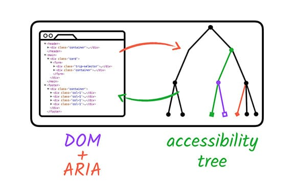

# ARIA와 HTML

대부분의 개발자들은 현대 웹의 표준 마크업 언어인 [하이퍼텍스트 마크업 언어(HTML)](https://developer.mozilla.org/ko/docs/Web/HTML)에 익숙합니다. 그러나 [접근 가능한 리치 인터넷 애플리케이션(ARIA)](https://developer.mozilla.org/ko/docs/Web/Accessibility/ARIA)(공식적으로 WAI-ARIA라고 불림)에 대해서는 덜 익숙할 수 있습니다: 그것이 무엇인지, 어떻게 사용되는지, 그리고 언제 사용해야 하는지 - 그리고 언제 사용하지 말아야 하는지에 대해서 말입니다.

HTML과 ARIA는 디지털 제품을 접근 가능하게 만드는 데 중요한 역할을 합니다. 특히 스크린 리더와 같은 보조 기술(AT)을 사용할 때 그렇습니다. 둘 다 콘텐츠를 점자나 텍스트 음성 변환(TTS)과 같은 대체 형식으로 변환하는 데 사용됩니다.

ARIA의 간단한 역사, 그것이 중요한 이유, 그리고 언제 어떻게 가장 잘 사용할 수 있는지 살펴보겠습니다.

</br>

## ARIA 소개

ARIA는 2008년에 [웹 접근성 이니셔티브(WAI)](https://www.w3.org/WAI/) 그룹에 의해 처음 개발되었습니다 - WAI는 인터넷을 관리하고 규제하는 전체적인 월드 와이드 웹 컨소시엄(W3C)의 하위 집합입니다.

ARIA는 진정한 프로그래밍 언어가 아니라 HTML 요소에 추가하여 접근성을 높일 수 있는 속성 집합입니다. 이러한 속성들은 현대 브라우저에서 발견되는 접근성 API를 통해 보조 기술에 역할, 상태, 속성을 전달합니다. 이 통신은 접근성 트리를 통해 이루어집니다.

> "[WAI-ARIA](https://www.w3.org/WAI/standards-guidelines/aria/), 접근 가능한 리치 인터넷 애플리케이션 스위트는 웹 콘텐츠와 웹 > 애플리케이션을 장애인들에게 더 접근 가능하게 만드는 방법을 정의합니다. 특히 HTML, JavaScript 및 관련 기술로 개발된 동적 콘텐츠와 고급 사용자 > 인터페이스 컨트롤에 도움이 됩니다."
>
> - [WAI 그룹](https://www.w3.org/WAI/)

</br>

### 접근성 트리

ARIA는 잘못되거나 불완전한 코드를 수정하여 AT를 사용하는 사람들에게 더 나은 경험을 제공합니다. 이는 접근성 트리의 일부를 변경하고, 노출하고, 보강함으로써 이루어집니다.

접근성 트리는 브라우저에 의해 생성되며 표준 문서 객체 모델(DOM) 트리를 기반으로 합니다. DOM 트리와 마찬가지로 접근성 트리에는 모든 마크업 요소, 속성, 텍스트 노드를 나타내는 객체가 포함됩니다. 접근성 트리는 또한 플랫폼별 접근성 API에서 보조 기술이 이해할 수 있는 표현을 제공하는 데 사용됩니다.



ARIA 자체는 요소의 기능이나 시각적 외관을 변경하지 않습니다. 즉, AT 사용자만이 ARIA가 있는 디지털 제품과 없는 제품 사이의 차이를 알아차릴 것입니다. 이는 또한 개발자들만이 요소를 가능한 한 접근 가능하게 만들기 위해 적절한 코드와 스타일 변경을 할 책임이 있다는 것을 의미합니다.

ARIA의 세 가지 주요 기능은 역할, 속성, 상태/값입니다.

*역할*은 페이지나 앱에서 요소가 무엇인지 또는 무엇을 하는지 정의합니다.

```javascript
<div role="button">Self-destruct</div>
```

*속성*은 객체의 특성이나 관계를 표현합니다.

```javascript
<div role="button" aria-describedby="more-info">Self-destruct</div>
<div id="more-info">This page will self-destruct in 10 seconds.</div>
```

*상태/값*은 요소와 관련된 현재 조건이나 데이터 값을 정의합니다.

```javascript
<div role="button" aria-describedby="more-info" aria-pressed="false">
Self-destruct
</div>
<div id="more-info">
This page will self-destruct in 10 seconds.
</div>
```

ARIA의 세 가지 요소를 모두 한 줄의 코드에서 사용할 수 있지만, 필수는 아닙니다. 대신, 최종 접근성 목표를 달성할 때까지 ARIA 역할, 속성, 상태/값을 계층화하세요. ARIA를 코드베이스에 올바르게 통합하면 AT 사용자가 웹사이트, 앱 또는 기타 디지털 제품을 성공적이고 공평하게 사용하는 데 필요한 모든 정보를 갖게 됩니다.

최근에 Chrome DevTools는 [전체 접근성 트리를 볼 수 있는 방법](https://developer.chrome.com/blog/full-accessibility-tree?hl=ko)을 만들어 개발자가 자신의 코드가 접근성에 어떤 영향을 미치는지 이해하기 쉽게 했습니다.

</br>

## ARIA를 사용해야 할 때

2014년, W3C는 공식적으로 HTML5 권장사항을 발표했습니다. 이와 함께 큰 변화가 있었는데, `<main>`, `<header>`, `<footer>`, `<aside>`, `<nav>`와 같은 랜드마크 요소와 `hidden`과 `required`와 같은 속성의 추가가 포함되었습니다. 이러한 새로운 HTML5 요소와 속성, 그리고 증가된 브라우저 지원과 함께, ARIA의 특정 부분은 이제 덜 중요해졌습니다.

브라우저가 ARIA 등가물이 있는 암시적 역할을 가진 HTML 태그를 지원할 때, 일반적으로 해당 요소에 ARIA를 추가할 필요가 없습니다. 그러나 ARIA에는 여전히 HTML의 어떤 버전에서도 사용할 수 없는 많은 역할, 상태, 속성이 포함되어 있습니다. 이러한 속성들은 현재로서는 여전히 유용합니다.

이는 우리를 궁극적인 질문으로 이끕니다: 언제 ARIA를 사용해야 할까요? 다행히도 WAI 그룹은 요소를 접근 가능하게 만드는 방법을 결정하는 데 도움이 되는 [ARIA의 다섯 가지 규칙](https://www.w3.org/TR/using-aria/)을 개발했습니다.

</br>

### 규칙 1: ARIA를 사용하지 마세요

네, 맞게 읽으셨습니다. 요소에 ARIA를 추가한다고 해서 본질적으로 더 접근 가능해지는 것은 아닙니다. [WebAIM Million 연례 접근성 보고서](https://webaim.org/projects/million/)에 따르면 ARIA가 있는 홈페이지는 ARIA가 없는 홈페이지보다 평균 70% 더 많은 오류가 감지되었습니다. 주로 ARIA 속성의 부적절한 구현 때문입니다.

이 규칙에는 예외가 있습니다. HTML 요소에 접근성 지원이 없을 때 ARIA가 필요합니다. 이는 디자인이 특정 HTML 요소를 허용하지 않거나 원하는 기능/동작이 HTML에서 사용할 수 없기 때문일 수 있습니다. 그러나 이러한 상황은 드물어야 합니다.

👎 **Don't**

```javascript
<a role="button">Submit</a>
```

👍 **Do**

```javascript
<button>Submit</button>
```

의심스러울 때는 [시맨틱 HTML 요소](https://web.dev/learn/html/semantic-html)를 사용하세요.

</br>

### 규칙 2: HTML에 (불필요한) ARIA를 추가하지 마세요

대부분의 경우, HTML 요소는 그대로 잘 작동하며 추가적인 ARIA가 필요하지 않습니다. 실제로 ARIA를 사용하는 개발자들은 종종 대화형 요소의 경우 요소를 기능적으로 만들기 위해 추가 코드를 추가해야 합니다.

👎 **Don't**

```javascript
<h2 role="tab">제목 탭</h2>
```

👍 **Do**

```javascript
<div role="tab">
  <h2>제목 탭</h2>
</div>
```

HTML 요소를 의도한 대로 사용하면 작업량이 줄어들고 성능이 더 좋은 코드를 얻을 수 있습니다.

</br>

### 규칙 3: 항상 키보드 탐색을 지원하세요

모든 대화형(비활성화되지 않은) ARIA 컨트롤은 키보드로 접근 가능해야 합니다. 일반적으로 키보드 포커스를 받지 않는 요소에 포커스가 필요한 경우 tabindex="0"을 추가할 수 있습니다. 잠재적인 키보드 포커스 순서 문제를 방지하기 위해 가능한 한 [양의 정수를 가진 탭 인덱스](https://www.scottohara.me/blog/2019/05/25/tabindex.html) 사용을 피하세요.

👎 **Don't**

```javascript
<span role="button" tabindex="1">
  Submit
</span>
```

👍 **Do**

```javascript
<span role="button" tabindex="0">
  Submit
</span>
```

물론, 이 경우 `<button>` 요소를 사용 할 수 있습니다.

> **Caution**: 시각 장애 여부와 관계없이 많은 사용자들이 키보드로 웹사이트를 탐색합니다. 제목이나 문단에 불필요한 탭 정지점을 넣으면 키보드로만 탐색하는 사용자들이 불편을 겪을 수 있으니 주의해주세요.

</br>

### 규칙 4: 포커스 가능한 요소를 숨기지 마세요

포커스가 필요한 요소에 `role="presentation"`이나 `aria-hidden="true"`를 추가하지 마세요 - `tabindex="0"`이 있는 요소를 포함해서요. 이러한 역할/상태를 요소에 추가하면 AT에 이러한 요소가 중요하지 않으며 건너뛰어야 한다는 메시지를 보냅니다. 이는 요소와 상호 작용하려는 사용자에게 혼란을 주거나 방해할 수 있습니다.

👎 **Don't**

```javascript
<div aria-hidden="true">
  <button>Submit</button>
</div>
```

👍 **Do**

```javascript
<div>
  <button>Submit</button>
</div>
```

</br>

### 규칙 5: 대화형 요소에 접근 가능한 이름을 사용하세요

대화형 요소의 목적은 사용자가 그것과 어떻게 상호 작용해야 하는지 알기 전에 전달되어야 합니다. AT 기기를 사용하는 사람들을 위해 모든 요소에 [접근 가능한 이름](https://www.w3.org/TR/accname-1.1/)이 있는지 확인하세요.

접근 가능한 이름은 요소로 둘러싸인 내용(`<a>`의 경우), 대체 텍스트, 또는 레이블일 수 있습니다.

다음 각 코드 샘플에서 접근 가능한 이름은 "빨간 가죽 부츠"입니다.

```javascript
<!-- 링크 태그 사이에 텍스트가 있는 일반 링크. -->
<a href="shoes.html">빨간 가죽 부츠</a>

<!-- 이미지에 대체 텍스트가 있는 링크된 이미지. -->
<a href="shoes.html"></a>

<!-- 레이블이 있는 체크박스 입력. -->
<input type="checkbox" id="shoes">
<label for="shoes">빨간 가죽 부츠</label>
```

요소의 접근 가능한 이름을 확인하는 방법은 여러 가지가 있습니다. [Chrome DevTools](https://developer.chrome.com/blog/full-accessibility-tree?hl=ko)를 사용하여 접근성 트리를 검사하거나 스크린 리더로 테스트하는 것이 포함됩니다.

> **Note**: 스크린 리더 테스트에 대한 자세한 내용은 곧 공개될 보조 기술 모듈에서 확인하실 수 있습니다.

</br>

## HTML에서의 ARIA

HTML 요소를 단독으로 사용하는 것이 가장 좋은 방법이지만, 특정 상황에서는 ARIA 요소를 추가할 수 있습니다. 예를 들어, 환경적 제약 때문에 더 높은 수준의 AT 지원이 필요한 패턴이나 모든 브라우저에서 완전히 지원되지 않는 HTML 요소의 대체 방법으로 ARIA를 HTML과 함께 사용할 수 있습니다.

물론 [HTML에 ARIA](https://www.w3.org/TR/html-aria/)를 구현하는 데에는 권장 사항이 있습니다. 가장 중요한 것은 기본 HTML 역할을 재정의하지 않고, 중복성을 줄이며, 의도하지 않은 부작용에 주의해야 한다는 것입니다.

몇 가지 예를 살펴보겠습니다.

👎 **Don't**

```javascript
<a role="heading">더 읽기</a>
```

> 잘못된 역할이 할당됨.

👍 **Do**

```javascript
<a aria-label="멋진 기사 제목에 대해 더 읽기">더 읽기</a>
```

> 올바른 역할과 추가 링크 설명.

</br>

👎 **Don't**

```javascript
<ul role="list">...</ul>
```

> 중복된 역할.

👍 **Do**

```javascript
<ul>...</ul>
```

> 중복 제거됨.

</br>

👎 **Don't**

```javascript
<details>
  <summary role="button">더 많은 정보</summary>
  ...
</details>
```

> 잠재적 부작용.

👍 **Do**

```javascript
<details>
  <summary>더 많은 정보</summary>
  ...
</details>
```

> 의도하지 않은 부작용 없음.

> **Note**:ARIA가 특히 유용한 곳은 폼(양식) 부분입니다. [폼 접근성 모듈에서 자세히 알아보세요.](https://web.dev/learn/forms/accessibility)

</br>

## ARIA의 복잡성

ARIA는 복잡하며, 사용할 때 항상 주의해야 합니다. 이 수업의 코드 예제는 꽤 간단하지만, 접근 가능한 사용자 정의 패턴을 만드는 것은 빠르게 복잡해질 수 있습니다.

키보드 상호작용, 터치 인터페이스, AT/브라우저 지원, 번역 요구사항, 환경적 제약, 레거시 코드, 사용자 선호도 등 주의해야 할 사항이 많습니다. 약간의 코딩 지식은 잘못 사용되면 해롭거나 단순히 짜증나는 결과를 초래할 수 있습니다. 코드를 단순하게 유지하는 것을 기억하세요.

이러한 경고에도 불구하고, 디지털 접근성은 전부 아니면 전무의 상황이 아닙니다 - 이와 같은 회색 영역을 허용하는 스펙트럼입니다. 상황에 따라 여러 코딩 솔루션이 "올바른" 것으로 간주될 수 있습니다. 중요한 것은 계속 학습하고, 테스트하고, 우리의 디지털 세계를 모두에게 더 개방적으로 만들기 위해 노력하는 것입니다.
